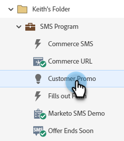
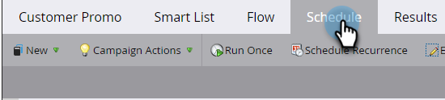

# SMS メッセージの送信 {#send-a-vibes-sms-message}

[SMS メッセージが作成されました &#x200B;](/help/marketo/product-docs/mobile-marketing/vibes-sms-messages/create-an-sms-message.md){target="_blank"}。次に送信します。 バッチまたはトリガーキャンペーンを介して送信できます。

>[!NOTE]
>
>SMS メッセージを送信する場合：
>
>* Marketo Engageでは、電話番号による重複排除が行われます。 したがって、複数のユーザーが同じ電話番号を持っている場合、1 つの Vibes サブスクリプションリストにのみメンバーであれば、1 人のユーザーのみがメッセージを受け取ります。 重複排除は、Marketo プログラムレベルではなく、Vibes サブスクリプションリストレベルで行われます。
>* メッセージはブロックリストに登録されたリードやマーケティングが中断されたリードには送信されません。
>* Vibes モバイルデータベース リストに登録されていない場合、SMS メッセージは登録を解除したユーザーには送信されません。

## バッチ SMS の送信 {#send-a-batch-sms}

1. My Marketo で、**マーケティング活動**&#x200B;をクリックします。

   

1. 目的のスマートキャンペーンを見つけて選択します。

   

1. 「**スマートリスト**」タブをクリックし、SMS のオーディエンスを定義します。 この例では、「Adobe」が会社としてリストされているデータベース内の全員に送信します。

   

1. 「**フロー**」タブで、「**SMS メッセージを送信**」上にドラッグします。 ドロップダウンから目的の SMS メッセージとバイブリストを選択します。

   

   >[!NOTE]
   >
   >バイブリスト セレクターは、スマートリストで既に識別されているオーディエンスに対するさらにフィルタリングとして機能し、そのバイブリストに属するユーザーのみをターゲットにします。

1. **スケジュール** タブをクリックして、SMS のスケジュールを設定します。

   

## トリガーSMS の送信 {#send-a-trigger-sms}

1. My Marketo で、**マーケティング活動**&#x200B;をクリックします。

   

1. 目的のスマートキャンペーンを見つけて選択します。

   

1. **スマートリスト** タブをクリックし、目的のトリガーを選択して、その値を定義します。 この例では、「フォームへの入力 **を使用し** います。

   

1. 「**フロー**」タブで、「**SMS メッセージを送信**」上にドラッグします。 ドロップダウンから目的の SMS メッセージとバイブリストを選択します。

   

   >[!NOTE]
   >
   >バイブリスト セレクターは、スマートリストで既に識別されているオーディエンスに対するさらにフィルタリングとして機能し、そのバイブリストに属するユーザーのみをターゲットにします。

1. 「**スケジュール**」タブをクリックし、「**アクティブ化** をクリックします。

   

>[!MORELIKETHIS]
>
>* [Vibes メッセージの作成 &#x200B;](/help/marketo/product-docs/mobile-marketing/vibes-sms-messages/create-an-sms-message.md){target="_blank"}
>* [&#x200B; スマートキャンペーンでの SMS オプションの使用 &#x200B;](/help/marketo/product-docs/mobile-marketing/vibes-sms-messages/using-sms-options-in-a-smart-campaign.md){target="_blank"}
