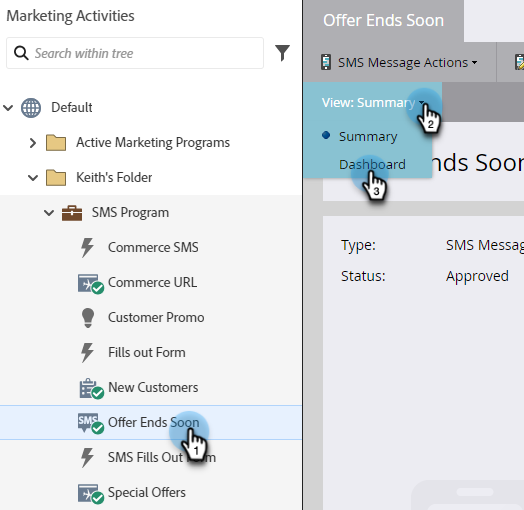
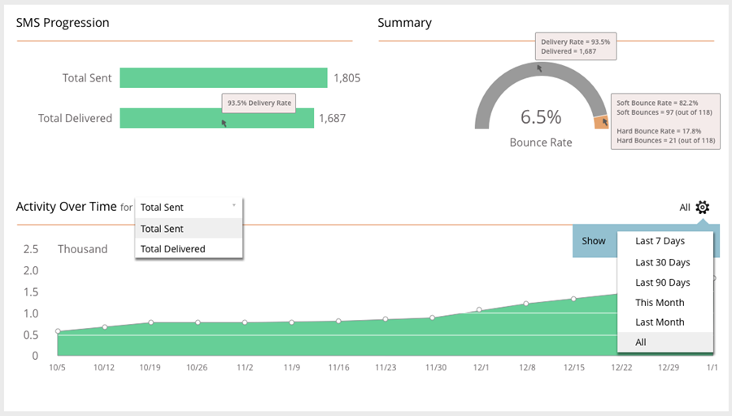
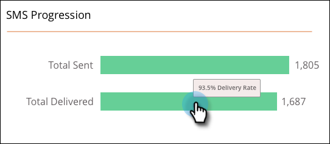
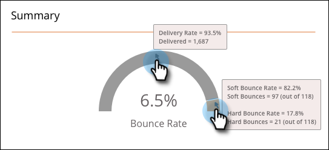
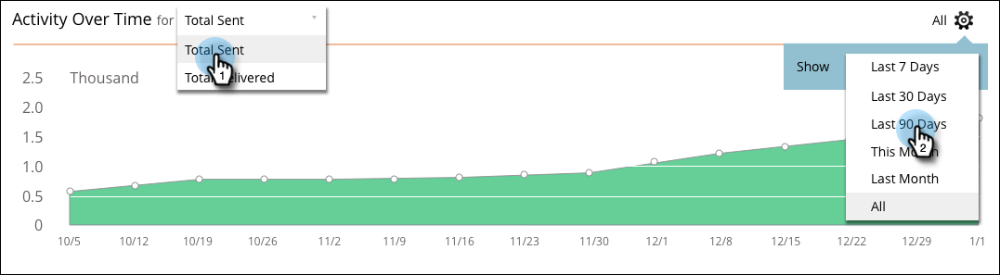

# SMS レポート {#sms-reporting}

SMS メッセージダッシュボードは、メッセージに関する有用な分析結果を提供します。

## ダッシュボードへのアクセス {#access-the-dashboard}

1. レポートを表示するには、目的のSMS メッセージを選択します。 **表示** ドロップダウンをクリックし、**ダッシュボード**&#x200B;を選択します。

   

1. ダッシュボードが表示されます。

   

## ダッシュボードの概要 {#dashboard-overview}

### SMS 進行状況 {#sms-progression}

合計送信数と合計配信数を表示します。 金額は右側にあり、バーにカーソルを合わせると、パーセンテージが表示されます。

### 概要 {#summary}

計算された直帰率をパーセントで表示します。 アーチバーにポインタを合わせると、配信率が量と割合で表示されます。 バーのオレンジ色の「バウンス率」セクションにカーソルを合わせると、ソフトバウンス率とハードバウンス率の金額/割合が表示されます。

### アクティビティの経過 {#activity-over-time}

「合計送信済み」または「合計配信済み」を選択できます。 日付範囲セレクターから適切な範囲を選択します。

