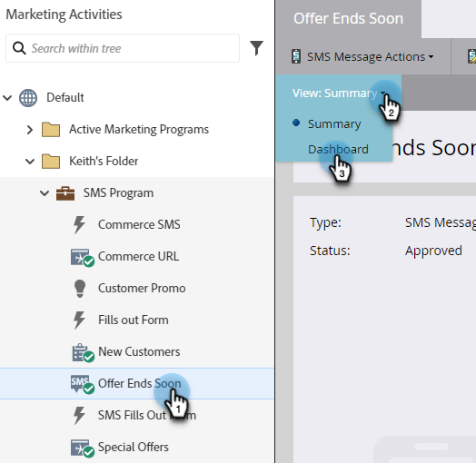

# SMS レポート {#sms-reporting}

SMS メッセージダッシュボードは、メッセージに対して有用な分析を提供します。

## ダッシュボードへのアクセス {#access-the-dashboard}

1. レポートを表示するには、目的の SMS メッセージを選択します。 次をクリック： **表示** ドロップダウンして「 」を選択します。 **ダッシュボード**.

   

1. ダッシュボードが表示されます。

   

## ダッシュボードの概要 {#dashboard-overview}

### SMS 進行状況 {#sms-progression}

合計送信数と合計配信数を表示します。 金額は右側に表示され、バーの上にマウスポインターを置くと、割合が表示されます。

### 概要 {#summary}

計算された直帰率を割合で表示します。 アーチバーにマウスポインタを合わせると、量と割合で配信率が表示されます。バーのオレンジ色の「バウンス率」セクションにマウスポインターを置くと、ソフトバウンス率とハードバウンス率の量/割合が表示されます。

### アクティビティの経過 {#activity-over-time}

「送信総数」または「配信済み合計」を選択できます。 日付範囲選択ツールから適切な範囲を選択します。

