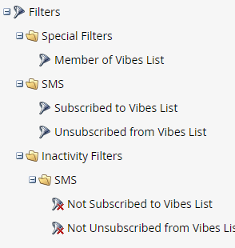

# スマートキャンペーンでの SMS オプションの使用 {#using-sms-options-in-a-smart-campaign}

SMS メッセージを[作成した後](/help/marketo/product-docs/mobile-marketing/vibes-sms-messages/create-an-sms-message.md){target="_blank"}、スマートキャンペーン内でスマートリストのトリガーとフィルターを使用してメリットを得る必要があります。

>[!NOTE]
>
>SMS メッセージの送信を検討している場合は、[固有の記事](/help/marketo/product-docs/mobile-marketing/vibes-sms-messages/send-an-sms-message.md){target="_blank"}があります。

>[!PREREQUISITES]
>
>SMS トリガー/フィルターは、[Vibes サービスが有効になっている場合にのみ表示されます](/help/marketo/product-docs/mobile-marketing/admin/add-vibes-as-a-launchpoint-service.md){target="_blank"}。

## SMS トリガー {#sms-triggers}

<table style="width:600px">
  <tr>
    <td style="width:50%"></td>
    <td style="width:50%"></td>
  </tr>
</table>

以下に、いくつかの例を示します。

**SMS メッセージのバウンス**&#x200B;トリガーは、SMS メッセージがバウンスしたときにメールの送信などのフローを開始します。

**Vibes リストの購読**&#x200B;トリガーは、ユーザーが購読するとフローを開始します。

**SMS メッセージ内のリンクをクリック**&#x200B;トリガーは、ユーザーが SMS メッセージ内のリンクをクリックすると、フローを開始します。

## SMS フィルター {#sms-filters}

<table style="width:600px">
  <tr>
    <td style="width:50%"></td>
    <td style="width:50%"></td>
  </tr>
</table>

**Vibes リストに購読済み**&#x200B;フィルターは、*一度でも* Vibes を購読していたことのあるすべての人を検索します。 削除されたリードがフローから除外されても、登録解除済みのリードと削除済みのリードの両方が含まれます。 このフィルターは、レポートに最適です。

これに対して、**Vibes リストのメンバー**&#x200B;フィルターは、現在 Vibes を購読している&#x200B;*すべての*&#x200B;ユーザを検索するので、スマートキャンペーンまたはリストでの使用に最も適しています。

>[!NOTE]
>
>すべてのSMS フィルターには、デフォルトで&#x200B;**アクティビティの日付**&#x200B;制約が含まれます。

## SMS フローステップ {#sms-flow-steps}

3つのSMS フローステップから選択できます。

<table>
<tbody>
  <tr>
    <td style="width:20%"><b>SMS メッセージの送信</b></td>
    <td>このフローアクションは、ユーザーがオプトインしたVibes サブスクリプションリストを購読しているMarketo スマートリストのユーザーにメッセージを送信します。 サブスクリプションプロセスは開始されません。 <a href="/help/marketo/product-docs/mobile-marketing/vibes-sms-messages/send-an-sms-message.md">詳細情報</a>。</td>
  </tr>

<tr>
    <td style="width:20%"><b>Vibes リストに配信登録</b></td>
    <td>このフローアクションは、ユーザーが選択したVibes獲得キャンペーンを介してSMS購読プロセスを開始します。 Vibesは確認メッセージを送信し、受信者はオプトインを確認するために24時間以内に「Y」と返信する必要があります。 ユーザーがオプトインすると、関連するVibes サブスクリプションリストのメンバーになります。</td>
  </tr>
  <tr>
    <td style="width:20%"><b>Vibes リストから配信停止</b></td>
    <td>このフローアクションは、ユーザーがオプトインしたVibes サブスクリプションリストから各ユーザーの購読を解除します。 ユーザーがコードに「STOP」とメッセージを送信すると、ユーザーの個人レコードが更新され、Vibes サブスクリプション リストのメンバーではなくなったことを反映します。</td>
  </tr>
  </tbody>
</table>

>[!NOTE]
>
>**Vibes リストに購読**&#x200B;および **Vibes リストから登録解除**&#x200B;フローには、異なる要件があります。 **購読**&#x200B;の場合、Vibes リストと Vibes 獲得キャンペーンを選択する必要があります。 **登録解除**&#x200B;の場合、Vibes リストのみが必要です。

>[!MORELIKETHIS]
>
>* [SMS メッセージを送信](/help/marketo/product-docs/mobile-marketing/vibes-sms-messages/send-an-sms-message.md){target="_blank"}
>* [スマートキャンペーン用スマートリストの定義 |トリガー](/help/marketo/product-docs/core-marketo-concepts/smart-campaigns/creating-a-smart-campaign/define-smart-list-for-smart-campaign-trigger.md){target="_blank"}
>* [スマートキャンペーン用スマートリストの定義 | バッチ](/help/marketo/product-docs/core-marketo-concepts/smart-campaigns/creating-a-smart-campaign/define-smart-list-for-smart-campaign-batch.md){target="_blank"}
