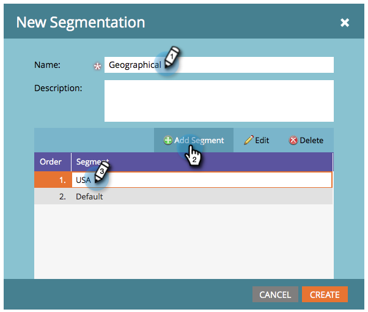

# セグメント化の作成 {#create-a-segmentation}

セグメント化を使用すると、レポートや動的コンテンツ用に、個々のユーザーを別々のプロファイルにグループ化できます。 作成する方法は、以下のとおりです。

1. **[!UICONTROL データベース]**&#x200B;に移動します。

   

1. 「**[!UICONTROL 新規]**」をクリックし、次に「**[!UICONTROL 新規セグメント化]**」をクリックします。

   

   >[!TIP]
   >
   >最大 20 個のセグメント化を作成できます。

1. **[!UICONTROL 名前]**&#x200B;を入力し、「**[!UICONTROL セグメントを追加]**」をクリックして名前を付けます。

   

   >[!NOTE]
   >
   >デフォルトは移動、編集、削除できません。

1. 必要な数のセグメントを追加します（最大 100 個）。

   

   >[!CAUTION]
   >
   >セグメント化で作成できるセグメントの合計数は、使用するフィルターの数と種類と、セグメントのロジックの複雑さによって異なります。 標準フィールドを使用して最大 100 個のセグメントを作成できますが、他のタイプのフィルターを使用すると複雑さが増し、セグメント化を承認できない場合があります。 例は、カスタムフィールド、リストのメンバー、リード所有者フィールド、収益ステージです。
   >
   >承認中にエラーメッセージが表示され、セグメント化の複雑さを軽減するためにサポートが必要な場合は、[Marketo サポート](https://nation.marketo.com/t5/Support/ct-p/Support)に問い合わせてください。

1. セグメントをドラッグ＆ドロップして順序を変更します。 完了したら、「**[!UICONTROL 作成]**」をクリックします。

   

   >[!NOTE]
   >
   >リードは、定義された[順序](/help/marketo/product-docs/personalization/segmentation-and-snippets/segmentation/segmentation-order-priority.md)で最初に一致するセグメントの資格を得ることになります。

   >[!NOTE]
   >
   >セグメント化を使用する前に、セグメントルールを定義する必要があります。

   これで完了です。 動的コンテンツの使用に一歩近づきました。

   >[!MORELIKETHIS]
   >
   >[セグメントルールの定義](/help/marketo/product-docs/personalization/segmentation-and-snippets/segmentation/define-segment-rules.md)
