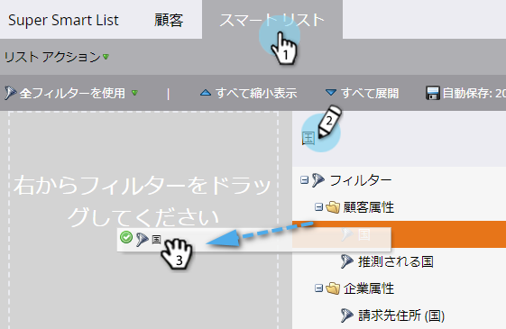
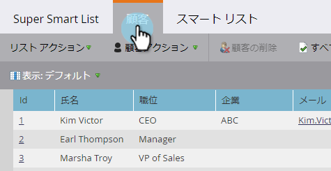

# セグメントルールの定義 {#define-segment-rules}

セグメントルールを定義すると、顧客を異なる相互に排他的なグループに分類できます。

>[!PREREQUISITES]
>
>[セグメント化の作成](/help/marketo/product-docs/personalization/segmentation-and-snippets/segmentation/create-a-segmentation.md)

1. 次に移動： **データベース。**

   

1. 選択 **セグメント化** ツリーから、特定の **セグメント**.

   

1. クリック **スマートリスト** フィルターを追加します。

   

   >[!CAUTION]
   >
   >セグメントは現在サポートされていません _過去_ および _期間内_  演算子を使用します。 これは、セグメント化では、変更データ値がログに記録されたときにのみ更新を確認するためです。 これらの値は次のとおりです。 _not_ 数式フィールドや日付など、自動的に変更される項目に対してログに記録されます。 また、相対的な日付範囲を持つ日付演算子は、データ値の変更アクティビティの時点ではなく、セグメント化の承認時に計算されるので、サポートされません。

   >[!NOTE]
   >
   >「SFDC タイプ」および「Microsoftタイプ」フィルターは、現在、セグメント化スマートリストではサポートされていません。

1. フィルターに適切な値を入力します。

   

   >[!CAUTION]
   >
   >アドバイス _対して_ セグメントルールを定義する際にアカウントフィールドを使用すると、アクティビティログに問題が発生する可能性があります。

1. 次をクリック： **担当者（下書き）** タブをクリックして、このセグメントのメンバーになる資格のある人を表示します。

   

1. に移動します。 **セグメント化アクション**. クリック **承認**.

   

   >[!CAUTION]
   >
   >セグメントで作成できるセグメントの合計数は、使用するフィルターの数と種類と、セグメントのロジックの複雑さによって異なります。 標準フィールドを使用して最大 100 個のセグメントを作成できますが、他のタイプのフィルターを使用すると複雑さが増し、セグメントを承認できない場合があります。 次に例を示します。カスタムフィールド、リストのメンバー、リード所有者フィールド、収益ステージ。
   >
   >承認中にエラーメッセージが表示され、セグメント化の複雑さを軽減するためにサポートが必要な場合は、 [Marketoサポート](https://nation.marketo.com/t5/Support/ct-p/Support).

1. ダッシュボードでは、円グラフでのセグメントおよび適用されたルールの概要をすばやく確認できます。

   

お疲れさまでした。 これらのセグメントはMarketoの多くの場所で役に立つでしょう。

>[!NOTE]
>
>ユーザーは様々なセグメントに適合する場合がありますが、最終的には、 [セグメントの優先順位](/help/marketo/product-docs/personalization/segmentation-and-snippets/segmentation/segmentation-order-priority.md).

>[!NOTE]
>
>人（下書き）画面には、メンバーとして認定されるすべての人が表示され、必ずしも人の最終リストとは限りません。 セグメントを承認して、最終リストを確認します。

>[!MORELIKETHIS]
>
>[セグメント化の承認](/help/marketo/product-docs/personalization/segmentation-and-snippets/segmentation/approve-a-segmentation.md)
