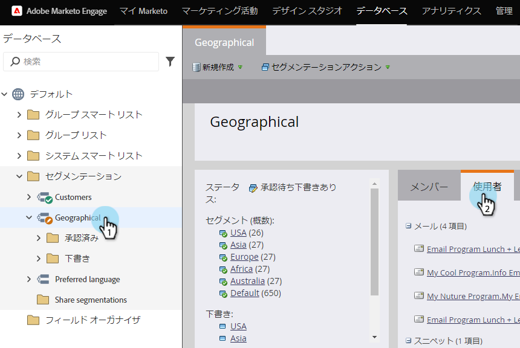
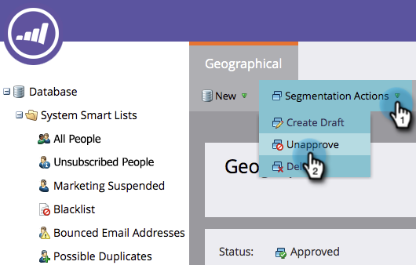

# セグメント化の削除 {#delete-a-segmentation}

セグメント化は、次の手順に従って削除できます。

1. **データベース**&#x200B;に移動します。

   

1. セグメント化に移動し、「**使用者**」をクリックして、関連付けを確認します。

   

   セグメント化が他のアセットで使用されている場合は、先に進む前に、関連付けを削除します。

1. すべての関連付けを削除し、「**セグメント化アクション**」で「**承認取消**」をクリックします。

   

   >[!NOTE]
   >
   >関連付けを削除するには、セグメントを使用するアセットの代替オプションを削除または作成します。

1. 承認が取り消されたら、「**セグメント化アクション**」をクリックしてセグメント化を削除します。

   

作業は以上です。元には戻せないので、セグメントが不要なことを確認してください。
