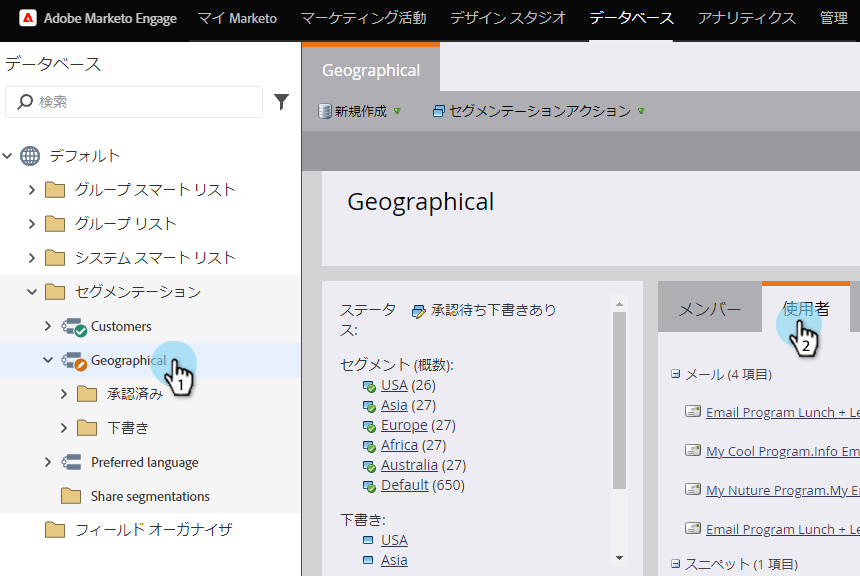

# セグメント化の削除 {#delete-a-segmentation}

セグメント化は、次の手順に従って削除できます。

1. **[!UICONTROL データベース]**&#x200B;に移動します。

   

1. セグメント化に移動し、「**[!UICONTROL 使用者]**」をクリックして、関連付けを確認します。

   

   セグメント化が他のアセットで使用されている場合は、先に進む前に、関連付けを削除します。

1. すべての関連付けを削除し、「**[!UICONTROL セグメント化アクション]**」で「**[!UICONTROL 承認取消]**」をクリックします。

   

   >[!NOTE]
   >
   >関連付けを削除するには、セグメントを使用するアセットの代替オプションを削除または作成します。

1. 承認が取り消されたら、「**[!UICONTROL セグメント化アクション]**」をクリックしてセグメント化を[!UICONTROL 削除]します。

   
