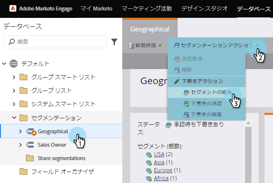
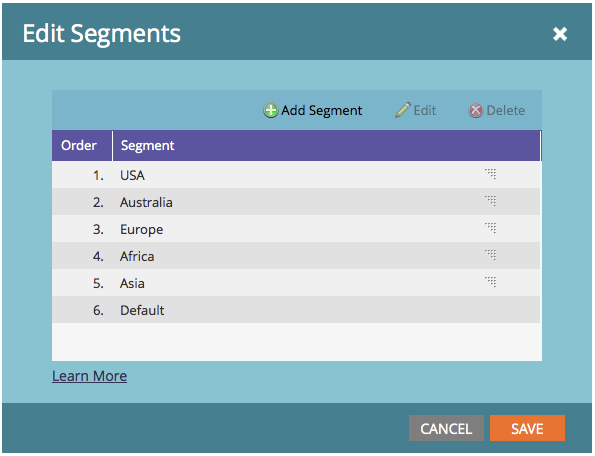
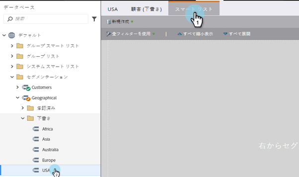

# セグメントの編集 {#edit-a-segmentation}

既存のセグメントに簡単に変更を加えることができます。 これが低い。

## セグメントドラフトの作成 {#create-a-segmentation-draft}

1. データ **ベースに移動します**。

   

1. セグメントで、「 **セグメントアクション** 」をクリックし、「ドラフトを **作成**」をクリックします。

   

1. 「**ステータス**」は「ドラフト付き承認済み」に変わります。 セグメント内に**ドラフト**フォルダーが作成されます。

   

## セグメントの追加編集、削除 {#add-edit-or-delete-segments}

1. セグメントで、[ **セグメントアクション** ]をクリックし、[セグメントの **編集**]をクリックします。

   

   >[!NOTE]
   >
   >ドラフトのセグメントの編集のみ可能で、承認済みセグメントは不可。

1. **セグメント**、*追加*既存のセグメントを編集（名前を変更または順序を変更）、**すべてのセグメントを削除します。

   

   >[!NOTE]
   >
   >セグメントを編集または削除する前に、セグメントを選択する必要があります。

   >[!CAUTION]
   >
   >削除すると、電子メール、ランディングページおよびスニペット内の関連するすべての動的コンテンツに影響します。 **取り消しはできません**。 「 **使用者** 」タブをオンにして、そのセグメントの用途を確認します。

## セグメントルールの編集 {#edit-segment-rules}

1. ドラフト **セグメント**&#x200B;で **、「ス**&#x200B;マートリスト」に移動します。 セグメントルールの [定義と同様のルールを適用します](http://docs.marketo.com/display/public/DOCS/Define+Segment+Rules)。

   

   >[!NOTE]
   >
   >承認済みのセグメントは編集できません。 ドラフトフォルダーのセグメントをクリックして編集します。

   >[!NOTE]
   >
   >**Reminder**
   >
   >
   >セグメントのドラフトを忘れずに承認してください。

動的コンテンツで使用されないセグメントを自由に試してみてください。

>[!NOTE]
>
>**関連記事**
>
>* [セグメントの削除](delete-a-segmentation.md)

>

