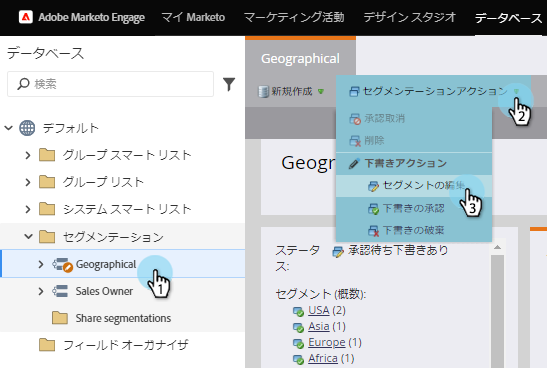
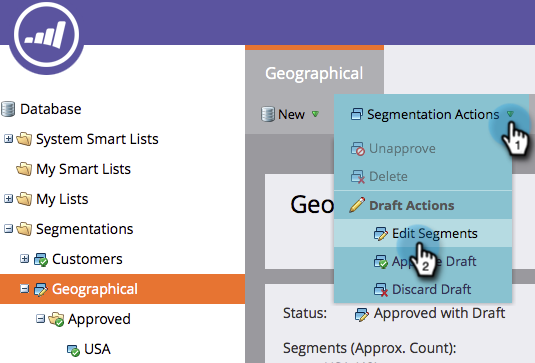
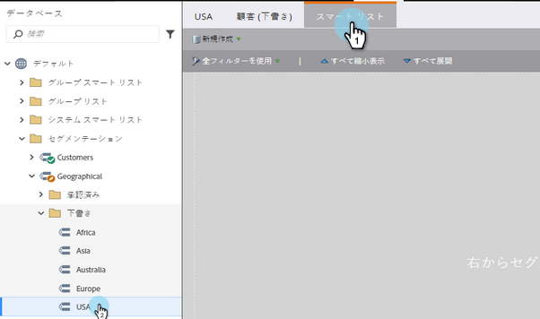

# セグメント化を編集する {#edit-a-segmentation}

既存のセグメント化に変更を加える作業は簡単です。これが不利な点です。

## セグメント化のドラフトを作成する {#create-a-segmentation-draft}

1. **[!UICONTROL データベース]**&#x200B;に移動します。

   

1. 「セグメント化」で、「**[!UICONTROL セグメント化アクション]**」をクリックし、「**[!UICONTROL ドラフトの作成]**」をクリックします。

   

1. 「**[!UICONTROL ステータス]**」が「[!UICONTROL ドラフトで承認済み]」に変わります。セグメント化に&#x200B;**[!UICONTROL ドラフト]**&#x200B;フォルダーが作成されます。

   

## セグメントの追加、編集、削除 {#add-edit-or-delete-segments}

1. セグメント化で、「**[!UICONTROL セグメント化アクション]**」をクリックし、「**[!UICONTROL セグメントを編集]**」をクリックします。

   

   >[!NOTE]
   >
   >[!UICONTROL ドラフト]のセグメントのみを編集でき、承認済みセグメントは編集できません。

1. **[!UICONTROL セグメントの追加]**、****&#x200B;編集（名前を変更または順序を変更）、または&#x200B;****&#x200B;セグメントの削除。

   

   >[!NOTE]
   >
   >セグメントを編集または削除する前に、セグメントを選択する必要があります。

   >[!CAUTION]
   >
   >削除すると、メール、ランディングページ、スニペット内のすべての動的コンテンツに影響します。**元に戻すことはできません**。セグメントが何によって使用されているかを確認するには、「**[!UICONTROL 使用者]**」タブをチェックしてください。

## セグメントルールを編集する {#edit-segment-rules}

1. [!UICONTROL ドラフト]の&#x200B;**セグメント**&#x200B;で、「**[!UICONTROL スマートリスト]**」に移動します。[セグメントルールの定義](/help/marketo/product-docs/personalization/segmentation-and-snippets/segmentation/define-segment-rules.md)と同様のルールを適用します。

   

   >[!NOTE]
   >
   >承認済みセグメントは編集できません。[!UICONTROL ドラフト]フォルダーにあるセグメントをクリックして編集してください。

   >[!NOTE]
   >
   >必ずセグメントのドラフトを承認してください。

動的コンテンツでは使用しないセグメント化を自由に試してみてください。

>[!MORELIKETHIS]
>
>[セグメント化の削除](/help/marketo/product-docs/personalization/segmentation-and-snippets/segmentation/delete-a-segmentation.md)
