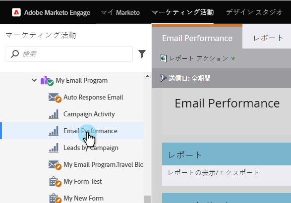
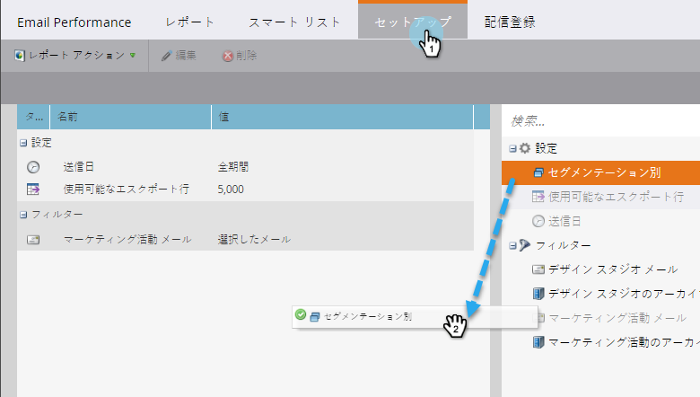

# セグメント別電子メールレポートのグループ化 {#group-email-reports-by-segmentations}

セグメント化は、動的コンテンツに対するものではありません。 また、 [電子メールのパフォーマンスレポートをセグメント別にグループ化することもできます](../../../../product-docs/email-marketing/email-programs/email-program-data/email-performance-report.md)。

>[!NOTE]
>
>**前提条件**
>
>* [セグメントの承認](approve-a-segmentation.md)

>

1. 「 **マーケティングアクティビティ** (または **Analytics**)」領域に移動します。

   

1. [ **電子メールのパフォーマンス** ]レポートを選択します。

   

1. 「 **セットアップ** 」タブをクリックし、「 **セグメント別グループ」上にドラッグします**。

   

1. レポートのグループ化に使用する1つまたは2つのセグメントを選択します。 「 **適用**」をクリックします。

   

1. それだ！ 「 **レポート** 」タブをクリックします。 1つのセグメントを使用する場合、レポートでは各セグメントに対して1行が表示されます。

   

1. 2つのセグメントを使用する場合、セグメントの *組み合わせごとに* 1行が表示されます。

   

>[!NOTE]
>
>**関連記事**
>
>* [電子メールレポートでのアセットのフィルタリング](../../../../product-docs/reporting/basic-reporting/report-activity/filter-assets-in-an-email-report.md)

>

