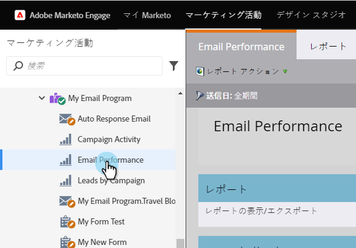
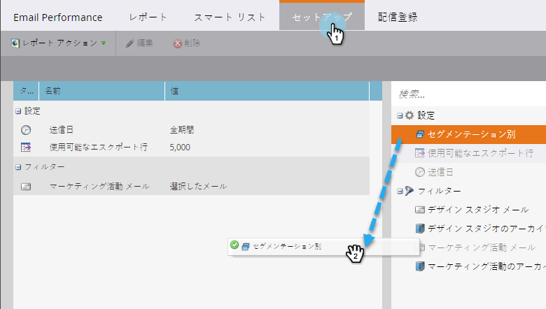

# メールレポートをセグメンテーション別にグループ化する {#group-email-reports-by-segmentations}

セグメンテーションは、動的コンテンツに限ったものではありません。 メールの効果レポートをセグメント別にグループ化することもできます。

>[!PREREQUISITES]
>
>[セグメンテーションの承認](/help/marketo/product-docs/personalization/segmentation-and-snippets/segmentation/approve-a-segmentation.md)

1. **[!UICONTROL マーケティング活動]**（または **[!UICONTROL Analytics]** エリア）に移動します。

   

1. **[!UICONTROL メールの効果]**&#x200B;レポートを選択します。

   

1. 「**[!UICONTROL 設定]**」タブをクリックして、**[!UICONTROL 「セグメンテーション別]**」をドラッグします。

   

1. レポートをグループ化するのに使用するセグメンテーションを 1 つまたは 2 つ選択します。 「**[!UICONTROL 適用]**」をクリックします。

   

1. 「**[!UICONTROL レポート]**」タブをクリックします。 1 つのセグメンテーションを使用する場合、レポートには各セグメントに対して 1 行が表示されます。

   

1. 2 つのセグメンテーションを使用する場合、それぞれのセグメントの&#x200B;_組み合わせ_&#x200B;に対して 1 行が表示されます。

   

>[!MORELIKETHIS]
>
>[メールレポートでのアセットのフィルター](/help/marketo/product-docs/reporting/basic-reporting/report-activity/filter-assets-in-an-email-report.md)
