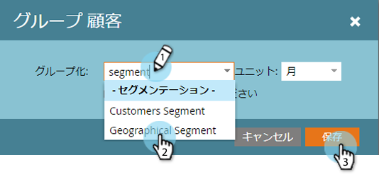

# セグメント別個人レポートのグループ化 {#group-person-reports-by-segment}

セグメントで [定義した任意の](http://docs.marketo.com/display/docs/basic+reporting) セグメントで [、](http://docs.marketo.com/display/docs/basic+reporting) 個人レポートをグループ化できます 。

>[!NOTE]
>
>**FYI**
>
>Marketoは現在、すべての購読で言語を標準化しているので、購読およびdocs.marketo.comの人物/人物にリード/リードを表示できます。 これらの用語は同じことを意味し、記事の説明には影響しません。 他にも変化がある。 [詳細情報](http://docs.marketo.com/display/DOCS/Updates+to+Marketo+Terminology)。

1. 「 **マーケティングアクティビティ** (または **Analytics**)」セクションに移動します。

   

1. ナビゲーションツリーから個人レポートを選択します。

   

   >[!NOTE]
   >
   >**ディープダイブ**
   >
   >
   >「 [基本レポート](http://docs.marketo.com/display/docs/basic+reporting) 」の詳細で、個人レポートおよびその他のレポートタイプについて説明します。

1. 「 **セットアップ** 」タブをクリックし、重複キーを押しながら「ユーザーをグループ化」をクリックし ****&#x200B;ます。

   

   >[!NOTE]
   >
   >個人または会社属性別に個人レポートを [グループ化することもできます](http://docs.marketo.com/display/DOCS/Group+Person+Reports+by+Attribute)。

1. ユーザーの **グループ化ダイアログで** 、開始がテキストボックスに「セグメント化」と入力します。 「 **セグメント** 」という見出しが表示されたら、見出しの下のリストから1つを選択します。

   

1. 「 **レポート** 」タブをクリックすると、選択したセグメント別にレポートがグループ化されて表示されます。

   

>[!NOTE]
>
>**ディープダイブ**
>
>セグメントの詳細と、セグメントを作成および管理する方法については、 [セグメント化](http://docs.marketo.com/display/docs/segmentation+and+snippets) （詳細）を参照してください。

>[!MORELIKETHIS]
>
>* [個人追加レポートのカスタム列](../../../../product-docs/reporting/basic-reporting/editing-reports/add-custom-columns-to-a-person-report.md)

>

