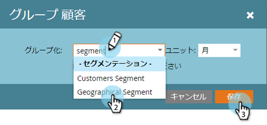

# 顧客の実績レポートをセグメント別にグループ化する {#group-person-reports-by-segment}

ユーザーレポートは、セグメント化で定義した任意のセグメント別にグループ化できます。

1. **[!UICONTROL マーケティング活動]**（または&#x200B;**[!UICONTROL 分析]**）セクションに移動します。

   

1. ナビゲーションツリーから任意の顧客の実績レポートを選択します。

   

1. 「**[!UICONTROL 設定]**」タブをクリックして、「**[!UICONTROL リードのグループ化基準]**」をダブルクリックします。

   

   >[!NOTE]
   >
   >[をリード別、または企業属性別にグループ化](/help/marketo/product-docs/reporting/basic-reporting/report-activity/group-person-reports-by-attribute.md)することもできます。

1. **[!UICONTROL リードのグループ化基準]**&#x200B;ダイアログで、テキストボックスに「segmentation」と入力し始めます。次の場合に&#x200B;**セグメンテーション**&#x200B;見出しが表示されたら、見出しの下のリストから 1 つ選択します。

   

1. 「**[!UICONTROL レポート]**」タブをクリックすると、選択したセグメント別にグループ化されたレポートが表示されます。

   

>[!MORELIKETHIS]
>
>[顧客の実績レポートへのカスタム列の追加](/help/marketo/product-docs/reporting/basic-reporting/editing-reports/add-custom-columns-to-a-person-report.md)
