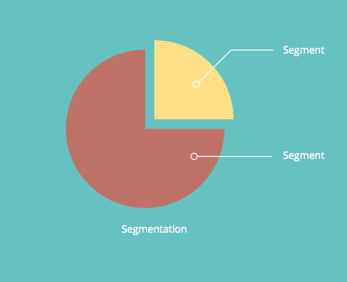

# 動的コンテンツについて {#understanding-dynamic-content}

パーソナライズ機能は、「こんにちは `{{First_Name}}`」に留まりません。 Marketo の動的コンテンツを使用すると、様々な訪問者にランディングページやメールを表示する方法をカスタマイズできます。

## セグメント化 {#segmentation}

まず、リードをサブグループに分割する必要があります。 これは、[セグメント化](/help/marketo/product-docs/personalization/segmentation-and-snippets/segmentation/create-a-segmentation.md)と呼ばれます。

>[!NOTE]
>
>**定義**
>
>セグメント化では、[スマートリスト](/help/marketo/product-docs/core-marketo-concepts/smart-campaigns/understanding-smart-campaigns.md)ルールに基づいてオーディエンスをさまざまなサブグループに分類します。 これらのグループはセグメントと呼ばれます。

例えば、「業界」というセグメントがある場合、セグメントは医療、技術、金融、消費財などになります。

## 動的コンテンツ {#dynamic-content}

様々なセグメントを作成したら、動的コンテンツブロックをランディングページやメールに追加できます。 これにより、どのユーザーがコンテンツを表示するのかに応じてそのコンテンツの一部を変えることができます。

## スニペット {#snippets}

[スニペット](/help/marketo/product-docs/personalization/segmentation-and-snippets/snippets/create-a-snippet.md)は、Marketo の便利なツールです。 1 回作成すれば、複数の場所で使用できます。 スニペットを更新すると、スニペットを使用するすべてのアセット（ランディングページまたはメール）が自動的に更新されます。

>[!NOTE]
>
>**例**
>
>* スニペットはメールの署名として使用できます。 受信者の場所に応じて、テキストを動的に変更します。
>* ランディングページには、顧客と見込み客でリンクが異なる標準のコールトゥアクション領域があります。 数百の LP を一元的に更新できます。

ぜひ、成功事例をお聞かせください。

>[!MORELIKETHIS]
>
>* [セグメント化の作成](/help/marketo/product-docs/personalization/segmentation-and-snippets/segmentation/create-a-segmentation.md)
>* [スニペットの作成](/help/marketo/product-docs/personalization/segmentation-and-snippets/snippets/create-a-snippet.md)
