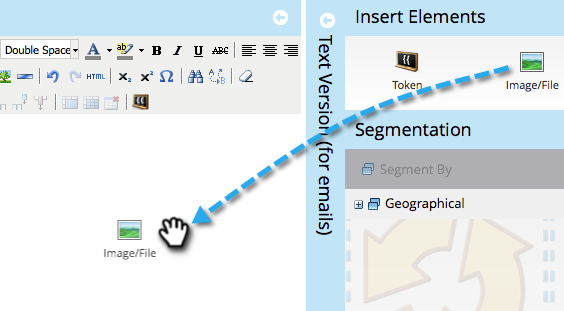

# スニペットへのコンテンツの追加 {#add-content-to-a-snippet}

>[!PREREQUISITES]
>
>[スニペットの作成](/help/marketo/product-docs/personalization/segmentation-and-snippets/snippets/create-a-snippet.md)

スニペットには、トークン、画像、ファイル、リッチテキストを追加できます。

>[!NOTE]
>
>スニペットに [Marketo メール構文](/help/marketo/product-docs/email-marketing/general/email-editor-2/email-template-syntax.md)を埋め込むことはできません。Marketo メール構文はメールで機能&#x200B;**しません**。 スニペットは本文コンテンツ（HTML+テキスト）にする必要があります。

1. **[!UICONTROL Design Studio]** に移動します。

   

1. 目的の&#x200B;**スニペット**&#x200B;を選択して、「**[!UICONTROL ドラフトを編集]**」をクリックします。

   

スニペットには、3 種類のコンテンツを追加できます。

## [!UICONTROL トークン]の追加 {#add-token}

1. **[!UICONTROL トークン]**&#x200B;要素をドラッグ＆ドロップします。

   

1. **[!UICONTROL トークン]**&#x200B;を入力して、「**[!UICONTROL 挿入]**」をクリックします。

   

## 画像／ファイルの追加 {#add-image-file}

1. **[!UICONTROL 画像／ファイル]**&#x200B;要素をドラッグ＆ドロップします。

   

   >[!NOTE]
   >
   >独自の画像やファイルを Marketo に追加できます。 画像とファイルについて詳しくは、[こちら](/help/marketo/product-docs/demand-generation/images-and-files/add-images-and-files-to-marketo.md)を参照してください。

1. 使用する&#x200B;**画像**&#x200B;を選択して、「**[!UICONTROL 挿入]**」をクリックします。

   

   >[!NOTE]
   >
   >特定の画像の名前がわかっている場合は、その画像を検索することもできます。

## テキストを入力 {#add-text}

1. テキストを追加する HTML のバージョン領域に入力します。

   

   >[!TIP]
   >
   >書式設定ツールを使用して、テキストをカスタマイズします。

1. メールの場合は、「**[!UICONTROL テキストバージョン（メールの場合）]**」タブをクリックします。

   

1. 「**[!UICONTROL HTML からコピー]**」をクリックします。

   

   >[!NOTE]
   >
   >画像、リンク、書式設定は、「テキスト」バージョンでは削除されます。

これで完了です。 これで、スニペット用の様々なコンテンツを作成できます。

>[!MORELIKETHIS]
>
>* [スニペットのプレビュー](/help/marketo/product-docs/personalization/segmentation-and-snippets/snippets/preview-a-snippet.md)
>* [スニペットの承認](/help/marketo/product-docs/personalization/segmentation-and-snippets/snippets/approve-a-snippet.md)
