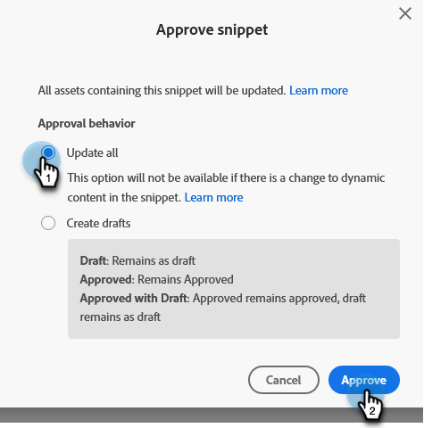

# ドラフトなしのスニペットを承認する {#approve-a-snippet-with-no-draft}

## スニペットを承認する {#approve-the-snippet}

スニペットが承認されるたびにドラフトなしがトリガーされます。これには、他のワークスペースでアセットによって共有、または参照されるスニペットも含まれます。

1. **[!UICONTROL Design Studio]** に移動します。

   

1. 目的のスニペットを探して選択します。

   

1. が含まれる **[!UICONTROL スニペットアクション]** ドロップダウン、を選択 **[!UICONTROL ドラフトを承認]**.

   

1. 「スニペットを承認」ダイアログボックスでオプションを選択し、をクリックします **[!UICONTROL 承認]**:

   * **[!UICONTROL すべて更新]**：スニペットを使用して承認したアセットのドラフトを作成しません。すべてのアセットが更新され、以前のステータスが維持されます。画面の右上に進行状況を示すモジュールが表示され、これはいつでも閉じることができます。再度開くには、スニペット名を右クリックして「承認ステータスの表示」を選択してください。
   * **[!UICONTROL ドラフトの作成]**：スニペットを使用して承認したアセットのドラフトを作成します。スニペットの変更を先にレビューする必要がある場合は、このオプションを選択してください。ドラフトはすべて、手動で承認する必要があります。

   

   >[!NOTE]
   >
   >まだ使用されていない新しいスニペットの場合、このドラフトの承認画面は表示されません。これは、スニペットが 1 つ以上のアセットで使用されると表示されます。

>[!CAUTION]
>
>この機能は、スニペット承認のワークフローで時間を節約するために用意されています。制限事項があるので、注意してください。を参照してください [この記事](https://nation.marketo.com/t5/knowledgebase/no-draft-snippet-limitations-and-troubleshooting/ta-p/300799){target="_blank"} を参照してください。

>[!MORELIKETHIS]
>
>[スニペットでドラフトなしを有効にする](/help/marketo/product-docs/administration/users-and-roles/enable-no-draft-for-snippets.md){target="_blank"}
