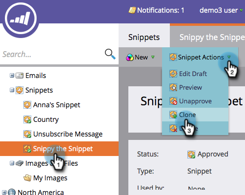

# スニペットを複製する {#clone-a-snippet}

スニペットを複製して同じもののコピーを作成し、必要に応じて変更することができます。

1. **Design Studio** に移動します。

   

1. 目的のスニペットに移動し、「**スニペットアクション**」で「**複製**」をクリックします。

   

1. スニペットの詳細を入力し、「**複製**」をクリックします。

   

これで完成です。複製したスニペットは、必要に応じて変更できます。

>[!MORELIKETHIS]
>
>[ダイナミックコンテンツでスニペットを編集する](/help/marketo/product-docs/personalization/segmentation-and-snippets/snippets/edit-snippets-with-dynamic-content.md)
