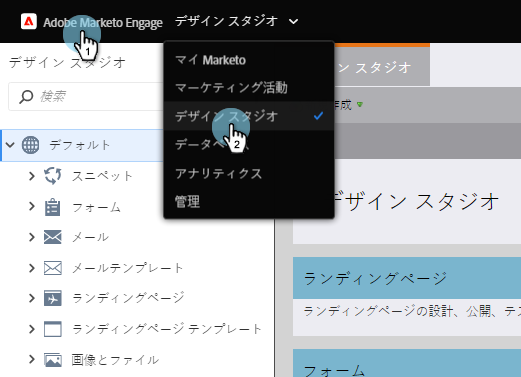

# スニペットの削除 {#delete-a-snippet}

>[!PREREQUISITES]
>
>* [スニペットの未承認](unapprove-a-snippet.md)

>

不要になったスニペットを削除します。

1. Design **Studioに移動します。**

   

1. スニペットに移動し、「 **スニペットのアクション** 」の下にある「 **削除**」をクリックします。

   

1. 「**削除**」をクリックして、確認を行うか、「 **キャンセル**」をクリックします。

   

   >[!NOTE]
   >
   >**Reminder**
   >
   >
   >削除できるのは、未承認でアセットで使用されていないスニペットのみです。

完了！ 取得できないので、削除ボタンをクリックする前に確認してください。
