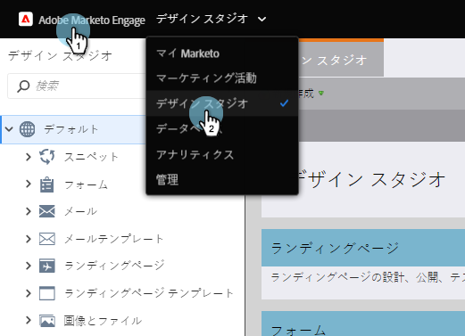

# スニペットの削除 {#delete-a-snippet}

>[!PREREQUISITES]
>
>[スニペットの承認取り消し](/help/marketo/product-docs/personalization/segmentation-and-snippets/snippets/unapprove-a-snippet.md)

不要になったスニペットを削除します。

1. **[!UICONTROL Design Studio]** に移動します。

   

1. 目的のスニペットに移動し「**[!UICONTROL スニペットアクション]**」で「**[!UICONTROL 削除]**」をクリックします。

   

1. 「**[!UICONTROL 削除]**」をクリックして確認するか、**[!UICONTROL キャンセル]**&#x200B;します。

   

   >[!NOTE]
   >
   >削除できるのは、承認が取り消され、どのアセットにも使用されていないスニペットだけです。

完了です。 取得はできないので、削除ボタンをクリックする前に確認してください。
