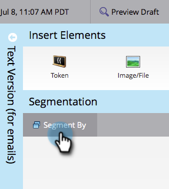
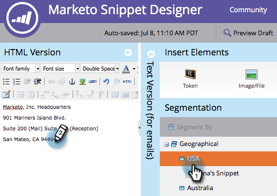

# 動的コンテンツでのスニペットの編集 {#edit-snippets-with-dynamic-content}

>[!NOTE]
>
>**前提条件**
>
>* [セグメントの作成](../../../../product-docs/personalization/segmentation-and-snippets/segmentation/create-a-segmentation.md)
>* [スニペットの作成](create-a-snippet.md)

>

スニペットのセグメント化を使用して、電子メールやランディングページの動的なコンテンツを簡単に管理できます。

## 追加分類 {#add-segmentation}

1. Design **Studioに移動します**。

   

1. **スニペット**をクリックし、「ドラフトを **編集**」をクリックします。

   

1. 「 **セグメント基準**」をクリックします。

   

1. 「**セグメント**」と入力し、「 **保存**」をクリックします。

   

## 動的コンテンツの適用 {#apply-dynamic-content}

1. 「**セグメント**」をクリックし、コンテンツを編集します。 各セグメントに対して同じ手順を繰り返す

   

>[!NOTE]
>
>**Reminder**
>
>スニペットを承認してから使用します。

単純じゃなかった？ これで、電子メールやランディングページでこれらのスニペットを使用する設定がすべて完了しました。

>[!NOTE]
>
>**関連記事**
>
>* [電子メ追加ールのスニペット](../../../../product-docs/email-marketing/general/functions-in-the-editor/add-a-snippet-to-an-email.md)
>* [ランディングページ追加のスニペット](../../../../product-docs/demand-generation/landing-pages/personalizing-landing-pages/add-a-snippet-to-a-landing-page.md)

>

