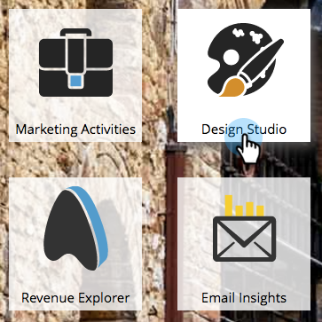

# 動的コンテンツでスニペットを編集する {#edit-snippets-with-dynamic-content}

>[!PREREQUISITES]
>
>* [セグメント化の作成](/help/marketo/product-docs/personalization/segmentation-and-snippets/segmentation/create-a-segmentation.md)
>* [スニペットの作成](/help/marketo/product-docs/personalization/segmentation-and-snippets/snippets/create-a-snippet.md)

スニペットのセグメント化を使用して、メールやランディングページの動的コンテンツを簡単に管理できます。

## セグメント化の追加 {#add-segmentation}

1. **[!UICONTROL Design Studio]** に移動します。

   

1. 目的の&#x200B;**スニペット**&#x200B;クリックしてから、「**[!UICONTROL ドラフトを編集]**」をクリックします。

   

1. 「**[!UICONTROL セグメント基準]**」をクリックします。

   

1. 「**[!UICONTROL セグメント化]**」と入力して、「**[!UICONTROL 保存]**」をクリックします。

   

## 動的コンテンツの適用 {#apply-dynamic-content}

1. **セグメント**&#x200B;をクリックしてコンテンツを編集します。各セグメントについて繰り返します。

   

>[!NOTE]
>
>スニペットを使用する前に、必ず承認してください。

簡単でしたね。これで、スニペットをメールとランディングページで使用する設定が完了しました。

>[!MORELIKETHIS]
>
>* [メールへのスニペットの追加](/help/marketo/product-docs/email-marketing/general/functions-in-the-editor/add-a-snippet-to-an-email.md)
>* [ランディングページへのスニペットの追加](/help/marketo/product-docs/demand-generation/landing-pages/personalizing-landing-pages/add-a-snippet-to-a-landing-page.md)
