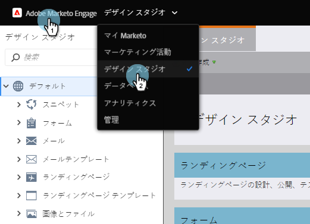
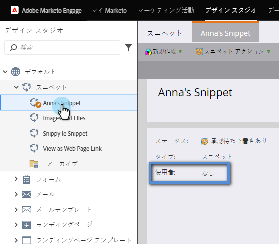

# スニペット{#unapprove-a-snippet}を非承認

未承認のスニペットは、電子メールやランディングページでは使用できません。

1. **Design Studioに移動します。**

   

1. スニペットに移動し、「**アセット**&#x200B;で使用」でないことを確認します。

   

   スニペットが他のアセットで使用されている場合は、先に進む前に関連付けを削除してください。

1. **スニペットアクション**&#x200B;で、**未承認**&#x200B;をクリックします。

   

それだ！ スニペットは、変更や削除を行える状態になりました。

