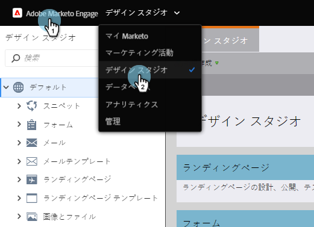
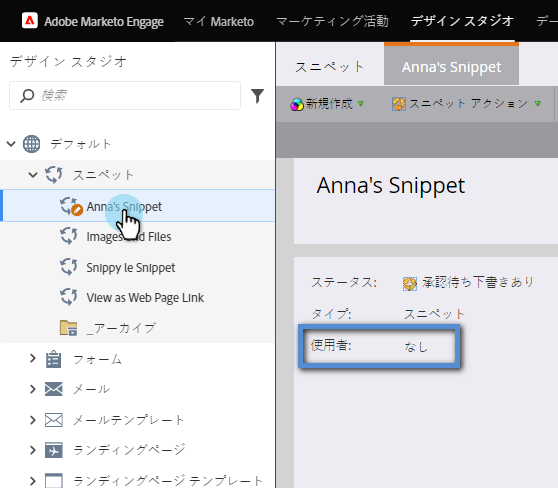

# スニペットの承認を取り消す {#unapprove-a-snippet}

未承認のスニペットは、メールやランディングページでは使用できません。

1. **[!UICONTROL Design Studio]** に移動します。

   

1. スニペットに移動し、アセット&#x200B;**[!UICONTROL で使用]**&#x200B;されていないことを確認します。

   

   スニペットが他のアセットで使用されている場合は、先に進む前に、関連付けを削除します。

1. **[!UICONTROL スニペットアクション]**&#x200B;で「**[!UICONTROL 承認取消]**」をクリックします。

   

スニペットは、変更や削除をおこなうためのドラフトステータスになっています。
