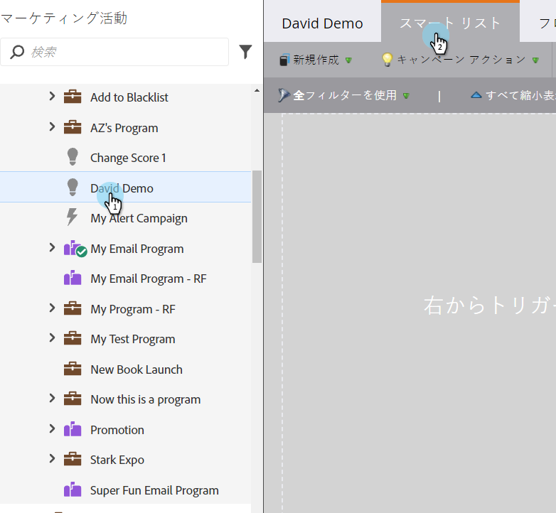
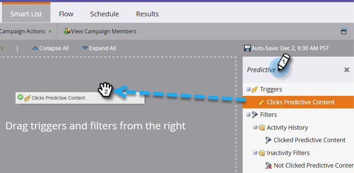
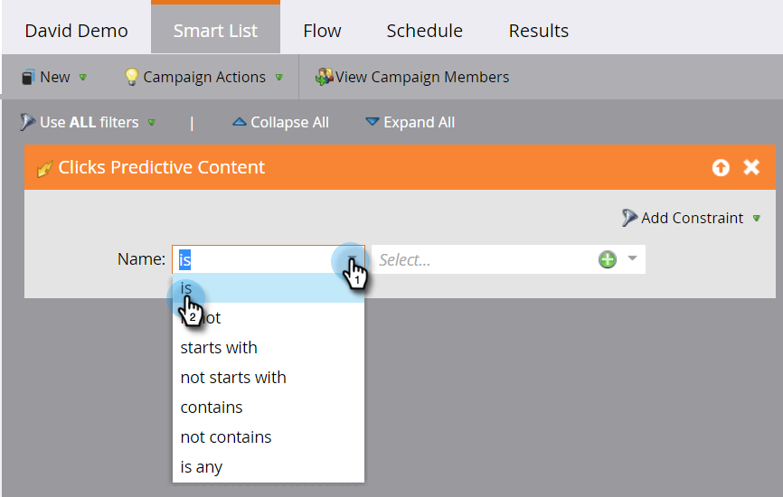
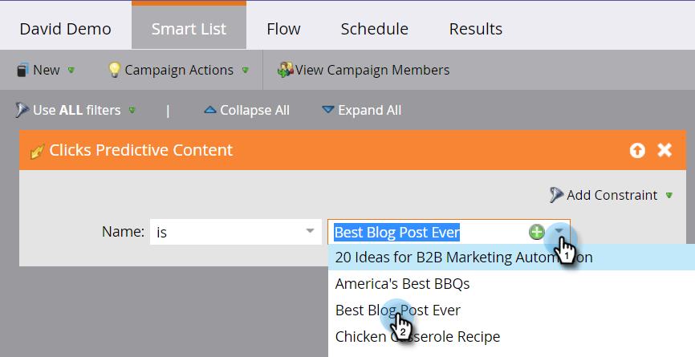
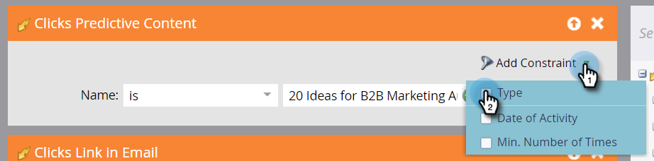
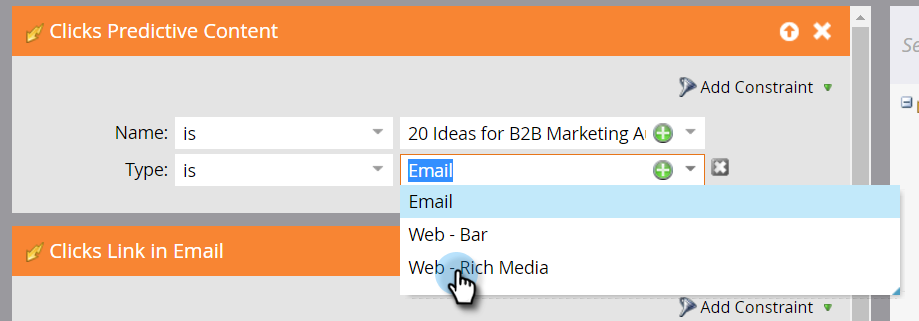
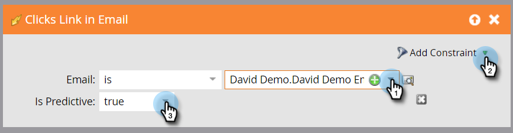
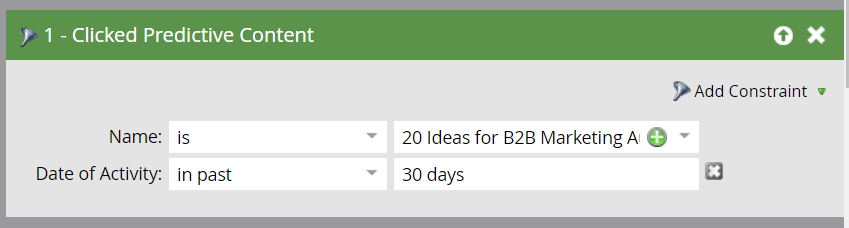

# 予測コンテンツアクティビティのスマートリストの定義 {#define-a-smart-list-for-predictive-content-activities}

スマートキャンペーンでスマートリストを定義するとき、「予測コンテンツ」の活動をトリガーとフィルターで使用できます。 [リッチメディアテンプレート](/help/marketo/product-docs/predictive-content/enabling-predictive-content/enable-predictive-content-for-web-rich-media.md)、[コンテンツレコメンデーションバー](/help/marketo/product-docs/predictive-content/enabling-predictive-content/enable-the-content-recommendation-bar.md)、または[メール](/help/marketo/product-docs/predictive-content/enabling-predictive-content/enable-predictive-content-in-emails.md)を使用して、予測コンテンツをクリックするすべての人に対してアクションをトリガーできます。

1. スマートキャンペーンで、「**[!UICONTROL スマートリスト]**」タブに移動します。

   

   >[!NOTE]
   >
   >スマートリストはとても便利です。 詳しくは、[スマートリストの詳細](/help/marketo/product-docs/core-marketo-concepts/smart-campaigns/understanding-smart-campaigns.md)を参照してください。

1. トリガーを検索し、キャンバスにドラッグ&amp;ドロップします。

   

   >[!NOTE]
   >
   >トリガーを使用したスマートキャンペーンは、トリガーモードで実行されます。 トリガーされたイベントと追加されたフィルターに基づいて、1 人につき一度ずつ実行されます。

1. 「**[!UICONTROL 名前]**」ドロップダウンをクリックし、演算子を選択します。

   

1. トリガーを定義します。

   

1. **[!UICONTROL タイプ]**&#x200B;の制約を追加します。

   

1. スマートリストに必要なソースを選択します。

   

1. 予測コンテンツにメールソースを使用している場合は、「**[!UICONTROL 電子メールのクリック数]**」トリガーを追加します。 メールを選択し、「**[!UICONTROL 予測である]**」制約（**[!UICONTROL true]** と定義）を追加します。

   

1. 必要に応じて、その他のフィルターを追加します。

   

   >[!TIP]
   >
   >トリガーとフィルターの両方を含むスマートキャンペーンでは、トリガーが一番上に表示されます。 トリガーされると、フィルター条件を満たす人のみがフローを通過します。

   >[!NOTE]
   >
   >複数のトリガーを使用する場合、いずれかのトリガーが有効化されると、フローに進みます。

   一連のリードに対してキャンペーンを同時に実行するには、[バッチスマートキャンペーンのスマートリストを定義する](/help/marketo/product-docs/core-marketo-concepts/smart-campaigns/creating-a-smart-campaign/define-smart-list-for-smart-campaign-batch.md)方法を参照してください。

   >[!MORELIKETHIS]
   >
   >* [スマートキャンペーン用スマートリストの定義 | バッチ](/help/marketo/product-docs/core-marketo-concepts/smart-campaigns/creating-a-smart-campaign/define-smart-list-for-smart-campaign-batch.md)
   >* [スマートキャンペーンへのフローステップの追加](/help/marketo/product-docs/core-marketo-concepts/smart-campaigns/flow-actions/add-a-flow-step-to-a-smart-campaign.md)
   >* [Web パーソナライゼーションアクティビティのスマートリストの定義](/help/marketo/product-docs/web-personalization/working-with-web-campaigns/define-a-smart-list-for-web-personalization-activities.md)
   >* [Web リッチメディアの予測コンテンツの有効化](/help/marketo/product-docs/predictive-content/enabling-predictive-content/enable-predictive-content-for-web-rich-media.md)
   >* [コンテンツレコメンデーションバーの有効化](/help/marketo/product-docs/predictive-content/enabling-predictive-content/enable-the-content-recommendation-bar.md)
