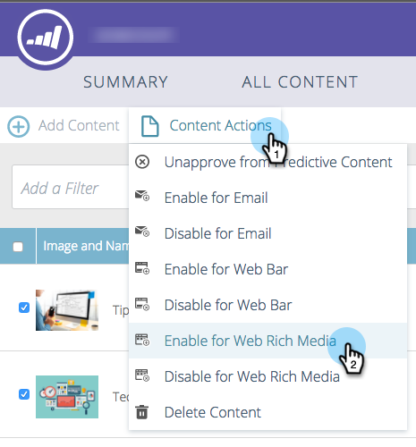

# Web リッチメディアの予測コンテンツを有効にする {#enable-predictive-content-for-web-rich-media}

Web リッチメディアは、機械学習と予測分析を利用して、最も関連性の高いコンテンツで web 訪問者を引きつける機能です。Web リッチメディアを使用すると、テキストの説明や画像を使用してコンテンツを強化し、web サイトに複数の予測コンテンツのレコメンデーションを埋め込むことができます。

>[!PREREQUISITES]
>
>予測コンテンツを有効にする前に、次の操作が必要です。
>
>* **予測コンテンツの準備**
>
>   * [メールの予測コンテンツの編集](/help/marketo/product-docs/predictive-content/working-with-predictive-content/edit-predictive-content-for-emails.md)、または
>   * [リッチメディアの予測コンテンツの編集](/help/marketo/product-docs/predictive-content/working-with-predictive-content/edit-predictive-content-for-rich-media.md)、または
>   * [レコメンデーションバーの予測コンテンツの編集](/help/marketo/product-docs/predictive-content/working-with-predictive-content/edit-predictive-content-for-the-recommendation-bar.md)
>
>* [予測コンテンツのタイトルの承認](/help/marketo/product-docs/predictive-content/working-with-all-content/approve-a-title-for-predictive-content.md)

リッチメディアのコンテンツタイトル、説明、画像を準備できたら、コンテンツピースを 1 つずつ、または複数まとめて有効にすることができます。

1. 個々のタイトルを有効にするには、タイトルをクリックしてエディターを開きます。「リッチメディア」をクリックし、「**リッチメディアでの予測コンテンツを有効にする**」ボックスをオンにして、「**保存**」をクリックします。

   

1. 複数のコンテンツがある場合は、**予測コンテンツ**&#x200B;ページで、タイトルの横にあるチェックボックスをオンにします。

   

1. 「**コンテンツアクション**」ドロップダウンをクリックし、「**Web リッチメディアを有効にする**」を選択します。

   |

## JavaScript コードのカスタマイズと web サイトへの埋め込み  {#customize-the-javascript-code-and-embed-it-into-your-website}

[Marketo Developers サイトのリッチメディアレコメンデーションテンプレートのドキュメントを参照してください。](https://developers.marketo.com/documentation/websites/rtp-rich-media-recommendations-api)ここでは、web サイトのテンプレートをカスタマイズする方法について説明します。

Web サイトでテンプレートを表示したい場所に JavaScript コードを貼り付けます。

**テンプレートの例**

* テンプレート 1：画像、ヘッダー、説明を含む 3 つの水平コンテンツ
* テンプレート 2：画像、ヘッダー、説明を含む 3 つの垂直コンテンツ

リッチメディアレコメンデーションテンプレート 1 の例を次に示します。

リッチメディアレコメンデーションテンプレート 2 の例を次に示します。

