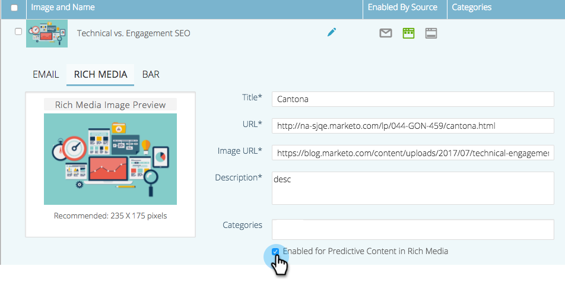

# Web リッチメディアの予測コンテンツの有効化 {#enable-predictive-content-for-web-rich-media}

Web リッチメディアは、機械学習と予測分析を利用して、最も関連性の高いコンテンツで web 訪問者を引きつける機能です。 Web リッチメディアを使用すると、テキストの説明や画像を使用してコンテンツを強化し、web サイトに複数の予測コンテンツのレコメンデーションを埋め込むことができます。

>[!NOTE]
>
>予測コンテンツをテストして使用する前に、カテゴリおよびソース（電子メール、リッチメディア、バー）ごとに5つ以上のコンテンツを有効にすることをお勧めします。 コンテンツが多いほど、より良い予測結果が得られます。

>[!PREREQUISITES]
>
>予測コンテンツを有効にする前に、次の操作が必要です。
>
>* **予測コンテンツの準備**
>
>   * [メールの予測コンテンツの編集](/help/marketo/product-docs/predictive-content/working-with-predictive-content/edit-predictive-content-for-emails.md){target="_blank"}、または
>   * [リッチメディアの予測コンテンツの編集](/help/marketo/product-docs/predictive-content/working-with-predictive-content/edit-predictive-content-for-rich-media.md){target="_blank"}、または
>   * [レコメンデーションバーの予測コンテンツの編集](/help/marketo/product-docs/predictive-content/working-with-predictive-content/edit-predictive-content-for-the-recommendation-bar.md){target="_blank"}
>
>* [予測コンテンツのタイトルの承認](/help/marketo/product-docs/predictive-content/working-with-all-content/approve-a-title-for-predictive-content.md){target="_blank"}

リッチメディアのコンテンツタイトル、説明、画像を準備できたら、コンテンツピースを 1 つずつ、または複数まとめて有効にすることができます。

1. 個々のタイトルを有効にするには、タイトルをクリックしてエディターを開きます。 「**[!UICONTROL リッチメディア]**」をクリックし、「**[!UICONTROL リッチメディアでの予測コンテンツを有効にする]**」ボックスをオンにして、「**[!UICONTROL 保存]**」をクリックします。

   

1. 複数のコンテンツがある場合は、**[!UICONTROL 予測コンテンツ]**&#x200B;ページで、タイトルの横にあるチェックボックスをオンにします。

   

1. 「**[!UICONTROL コンテンツアクション]**」ドロップダウンをクリックし、「**[!UICONTROL Web リッチメディアを有効にする]**」を選択します。

   |

## JavaScript コードのカスタマイズと web サイトへの埋め込み  {#customize-the-javascript-code-and-embed-it-into-your-website}

詳しくは、[Marketo Developers サイト](https://experienceleague.adobe.com/ja/docs/marketo-developer/marketo/javascriptapi/rich-media-recommendation){target="_blank"}のリッチメディアレコメンデーションテンプレートのドキュメントを参照してください。 ここでは、web サイトのテンプレートをカスタマイズする方法について説明します。

Web サイトでテンプレートを表示したい場所に JavaScript コードを貼り付けます。

**テンプレートの例**

* テンプレート 1：画像、ヘッダー、説明を含む 3 つの水平コンテンツ
* テンプレート 2：画像、ヘッダー、説明を含む 3 つの垂直コンテンツ

リッチメディアレコメンデーションテンプレート 1 の例を次に示します。

リッチメディアレコメンデーションテンプレート 2 の例を次に示します。

