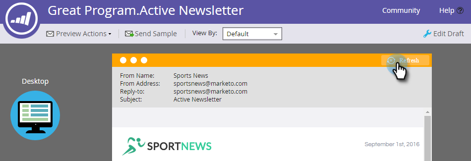
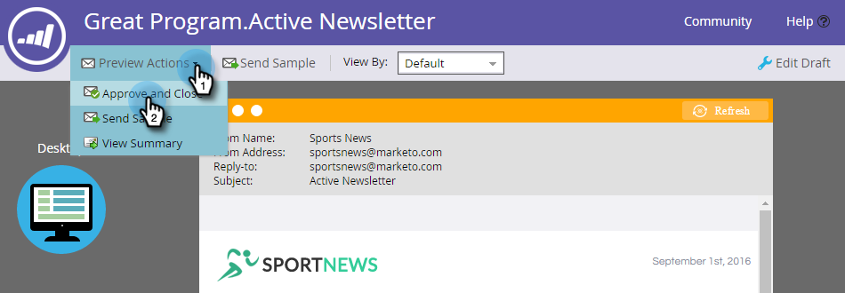

# メールの予測コンテンツを有効にする {#enable-predictive-content-in-emails}

メールの予測用に 1 つ以上の画像を作成し、各受信者のエクスペリエンスを調整します。

>[!NOTE]
>
>予測コンテンツをテストして使用する前に、カテゴリごとおよびソース（メール、リッチメディア、バー）ごとに 5 つ以上のコンテンツを有効にすることをお勧めします。コンテンツが多いほど、より良い予測結果が得られます。

>[!PREREQUISITES]
>
>予測コンテンツを有効にする前に、次の操作が必要です。
>
>* **予測コンテンツの準備**
   >
   >   * [メールの予測コンテンツの編集](/help/marketo/product-docs/predictive-content/working-with-predictive-content/edit-predictive-content-for-emails.md){target=&quot;_blank&quot;} または
   >   * [リッチメディア用予測コンテンツの編集](/help/marketo/product-docs/predictive-content/working-with-predictive-content/edit-predictive-content-for-rich-media.md){target=&quot;_blank&quot;} または
   >   * [レコメンデーションバーの予測コンテンツの編集](/help/marketo/product-docs/predictive-content/working-with-predictive-content/edit-predictive-content-for-the-recommendation-bar.md){target=&quot;_blank&quot;}
>
>* [予測コンテンツのタイトルを承認](/help/marketo/product-docs/predictive-content/working-with-all-content/approve-a-title-for-predictive-content.md){target=&quot;_blank&quot;}


## メール 2.0 エディターを使用した予測コンテンツの追加 {#adding-predictive-content-using-the-email-editor}

1. 「**マーケティング活動**」をクリックします。

   

1. メールを選択して、「**ドラフトの編集**」をクリックします。

   

1. 予測をおこなう画像をクリックします。歯車アイコンが表示されたら、それをクリックして「**ContentAI を有効にする**」を選択します（ContentAI は予測コンテンツの旧名称です）。

   

1. 1 つまたは複数のカテゴリを選択するには、**カテゴリ**&#x200B;ドロップダウンで、選択をおこなって「**適用**」をクリックします。

   

   >[!NOTE]
   >
   >特定のカテゴリの選択または予測レイアウトの変更はオプションです。

1. これで、画像が予測可能になりました。必要に応じて、追加の画像に対して手順 3 と 4 を繰り返します。

   

1. メールをプレビューするには、右上済の「**プレビュー**」をクリックします。

   

1. 様々な可能な画像を表示するには、「**更新**」をクリックします。

   

   >[!NOTE]
   >
   >画像は、**_受信者がメールを開くまで_**&#x200B;選択されません。したがって、プレビューに表示される内容は単なる例であり、必ずしも受信者に表示される画像とは限りません。

1. メールのプレビューが完了したら、**プレビューアクション**&#x200B;ドロップダウンをクリックして「**承認して閉じる**」を選択します。まだ編集が必要な場合は、右側にある「**ドラフトを編集**」をクリックします。

   

   >[!NOTE]
   >
   >サンプルを送信する際に、ランダムな画像が選択されます。

メールを承認すると、予測コンテンツが搭載され、送信の準備が整います。

>[!CAUTION]
>
>受信者がメールを開くと、予測画像はロックされます。コンテンツが後で削除された場合、受信者には、コンテンツがあった場所に壊れた画像が表示されます。

## メール 2.0 エディターを使用しない場合の予測コンテンツの追加 {#adding-predictive-content-when-not-using-the-email-editor}

を使用していない場合、 [Email 2.0](/help/marketo/product-docs/email-marketing/general/email-editor-2/email-editor-v2-0-overview.md){target=&quot;_blank&quot;} テンプレートを使用して、メールに予測コンテンツを追加するには、テンプレート内の画像をMarketoの編集可能な画像要素としてタグ付けするだけで済みます。

詳しくは、 [Marketo固有の構文はこちら](/help/marketo/product-docs/email-marketing/general/email-editor-2/email-template-syntax.md#elements){target=&quot;_blank&quot;}。

コードの例を次に示します（これは一例です。以下のコードをそのままコピーしないでください）。

**例**

```example
<div class="mktoImg" id="exampleImg" mktoName="Example Image" mktoImgLink="https://www.marketo.com">  
<a></a>  
</div>
```
