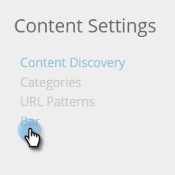
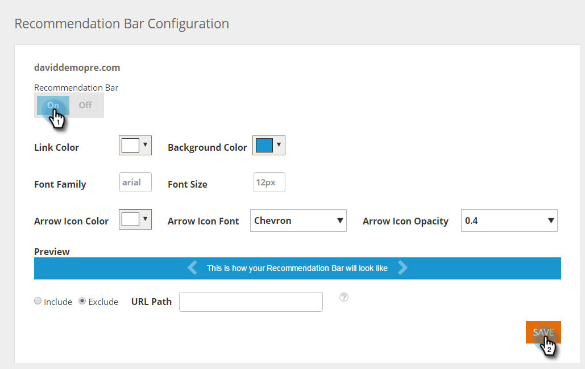
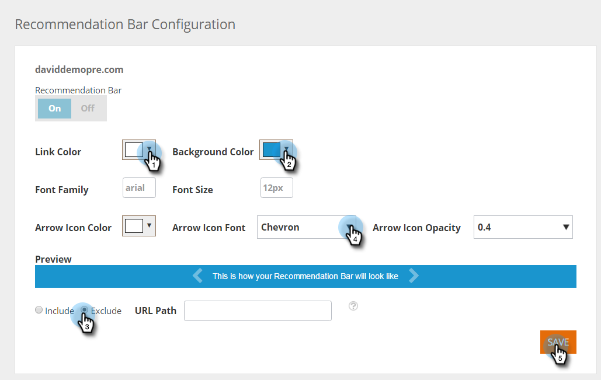

# コンテンツレコメンデーションバーを有効にする {#enable-the-content-recommendation-bar}

コンテンツレコメンデーションエンジンは、予測分析と機械学習アルゴリズムを使用して、web 訪問者ごとに関連性の高いコンテンツを提供します。 レコメンデーションエンジンは、訪問者ごとに最もパフォーマンスの高いコンテンツを予測します。 エンジンのコンテンツの監視と管理は、レコメンデーションページで行い、コンテンツの ROI を最適化に役立ちます。

>[!PREREQUISITES]
>
>予測コンテンツを有効にする前に、次の操作が必要です。
>
>* **予測コンテンツの準備**
>
>   * [メールの予測コンテンツの編集](/help/marketo/product-docs/predictive-content/working-with-predictive-content/edit-predictive-content-for-emails.md)、または
>   * [リッチメディアの予測コンテンツの編集](/help/marketo/product-docs/predictive-content/working-with-predictive-content/edit-predictive-content-for-rich-media.md)、または
>   * [レコメンデーションバーの予測コンテンツの編集](/help/marketo/product-docs/predictive-content/working-with-predictive-content/edit-predictive-content-for-the-recommendation-bar.md)
>
>* [予測コンテンツのタイトルの承認](/help/marketo/product-docs/predictive-content/working-with-all-content/approve-a-title-for-predictive-content.md)

## コンテンツレコメンデーションバーの有効化とカスタマイズ {#enable-and-customize-the-content-recommendation-bar}

1. 「**[!UICONTROL コンテンツ設定]**」に移動します。

   

1. 「**[!UICONTROL バー]**」をクリックします。

   

1. URL に対してレコメンデーションバーを有効にするには、「**[!UICONTROL オン]**」をクリックし、「**[!UICONTROL 保存]**」をクリックします。

   

1. URL をカスタマイズするには、レコメンデーションバーの色、スタイル、形式、矢印、バーを含めるまたは除外するページを選択します。 Web サイトのブランディングに合わせてカスタマイズします。 「**[!UICONTROL 保存]**」をクリックします。

   

   >[!NOTE]
   >
   >**表示 URL を含める／除外する**
   >
   >* 表示 URL はドメインのパスにする必要があります
   >* https:// や https:// は含めません
   >* ワイルドカードには &#42; を指定します。
   >* セミコロンを区切り記号として使用します。
   >* 例：/contact_us&#42;、&#42;action=logout&#42;
   >* このフィールドでは大文字と小文字が区別されます

## レコメンデーションバーについての注意事項 {#recommendation-bar-considerations}

* レコメンデーションエンジンを動作させるには、レコメンデーションページでレコメンデーションバーが「**[!UICONTROL オン]**」に設定されたコンテンツが少なくとも 1 つ必要です。 有効なコンテンツがなく、バーが「**[!UICONTROL オン]**」に設定されている場合、矢印効果は web ページの右下に表示されますが、推奨コンテンツは表示されません。

* レコメンデーションエンジンで実行されるコンテンツが多いほど、アルゴリズムがどのコンテンツが最も効果が高いかをテストし、学習するのに適しています。 まずは 10～20 個のコンテンツから実行しアクティブにして、新しいコンテンツを追加し続けることをお勧めします。
* レコメンデーション用に有効にするコンテンツには、RTP JavaScript タグを含める必要があります。 これは、アルゴリズムが推奨コンテンツを追跡し、最適化するのに役立ちます。

>[!MORELIKETHIS]
>
>[Web リッチメディアの予測コンテンツの有効化](/help/marketo/product-docs/predictive-content/enabling-predictive-content/enable-predictive-content-for-web-rich-media.md)
