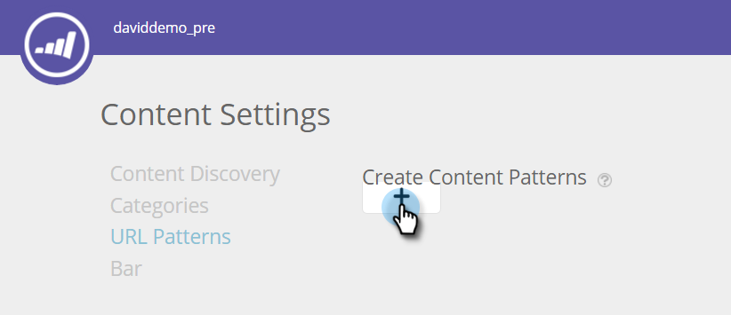

# コンテンツパターンの作成 {#create-content-patterns}

コンテンツパターンを設定すると、web 訪問者がそのコンテンツパターンに関連する HTML web ページをクリックしたとき、コンテンツが自動検出されます。これは、コンテンツ分析ページにコンテンツとして HTML ページ（ブログ投稿、プレスリリース、ニュース記事など）を追加するために使用されます。コンテンツパターンに基づいて自動検出すると、web 訪問者が閲覧しているとき、またはページへのリンクをクリックするときに、定義された URL パターンに関連する HTML ページを検出し、トラックすることができます。このコンテンツ（URL、ページ名、画像 URL などのメタデータ、説明）は、予測コンテンツを作成する際、すべてのコンテンツページに追加されます。PDF や埋め込み動画など、その他のコンテンツの自動検出については、[コンテンツ検索を有効にする](/help/marketo/product-docs/predictive-content/getting-started/enable-content-discovery.md)必要があります。

1. 「**コンテンツ設定**」に移動します。

   

1. 「**URL パターン**」をクリックします。

   

1. 「**+**」をクリックして行を開き、情報を入力します。

   

1. Web ページが存在するドメインの URL 拡張子を追加します。カテゴリを選択します（例：ブログ、記事、データシート、プレスリリース）。

   

   >[!NOTE]
   >
   >右側のドロップダウンリストの項目は、[作成したカテゴリ](/help/marketo/product-docs/predictive-content/getting-started/set-up-categories.md)に設定したカテゴリを反映しています。

1. 「**+**」をクリックして、別のパスを追加します。

   

1. 追加パスの拡張子とカテゴリを追加し、「**保存**」をクリックします。

   

## コンテンツパターンのルール {#content-pattern-rules}

* 式の任意の場所でワイルドカードを使用できます（例：_domain.com/*_、_domain.com/*blog*_）

* パターン検出を続行するには、式の末尾に /* を使用することをお勧めします（例：_domain.com/blog/*_ は、ブログフォルダー内のすべての投稿を検出します）。
* コンテンツパターンでは大文字と小文字が区別されません（例：_domain.com/Blog/*_ は、_domain.com/Blog_ および _domain.com/blog_ のすべての HTML ページを検出します）。

* URL パラメーターは検出しません（これにより、同じコンテンツ URL で異なるパラメーターを持つ複数の項目が検出されるのを回避します）

## 例 {#examples}

_domain.com_ の場合：

<table> 
 <tbody> 
  <tr> 
   <th>URL パターン</th> 
   <th>結果</th> 
  </tr> 
  <tr> 
   <td>blog/*</td> 
   <td>
domain.com/blog/ というパターンに一致するすべてのコンテンツを検出します。

domain.com/blog/5-top-tricks

domain.com/blog/2017/new-year-solutions

domain.com/Blog/3-best-recipes
</td> 
  </tr> 
  <tr> 
   <td>article/2017/*</td> 
   <td>
domain.com/article/2017/ というパターンに一致するすべてのコンテンツを検出します。

domain.com/article/2017/5-top-tricks
</td> 
  </tr> 
  <tr> 
   <td></td> 
   <td>
「datasheets」という単語を含む URL を検出します。

domain.com/datasheets/5-top-tricks

domain.com/blog/5-top-datasheets
</td> 
  </tr> 
  <tr> 
   <td>press-release</td> 
   <td>
完全に一致する HTML ページが 1 つだけ検出されます。

domain.com/press-release
</td> 
  </tr> 
  <tr> 
   <td colspan="1"> </td> 
   <td colspan="1">
URL 式が空の場合、URL パターンはホームページのみを検出します。

domain.com
</td> 
  </tr> 
 </tbody> 
</table>
