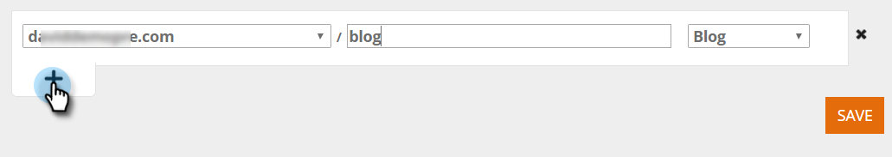

# コンテンツパターンを作成{#create-content-patterns}

コンテンツパターンを設定すると、Web訪問者がコンテンツパターンに関連するHTML Webページをクリックしたときに、コンテンツが自動検出されます。 HTMLページ（ブログ投稿、プレスリリース、ニュース記事）をコンテンツ要素として「すべてのコンテンツ」ページに追加するために使用します。 コンテンツパターンに基づいた自動検出では、Web訪問者ーがページへのリンクを表示またはクリックしたときに、定義済みのURLパターンに関連するHTMLページを検出して追跡します。 このコンテンツ部分（URL、ページ名、画像URLや説明を含むメタデータ）をすべてのコンテンツページに追加して、予測コンテンツを準備します。 PDFや埋め込みビデオなど、他のコンテンツを自動検出するには、[コンテンツ検出を有効にする](/help/marketo/product-docs/predictive-content/getting-started/enable-content-discovery.md)必要があります。

1. 「**コンテンツ設定**」に移動します。

   

1. 「**URLパターン**」をクリックします。

   

1. **+**&#x200B;をクリックすると、情報を入力できる行が開きます。

   

1. webページが追加存在するドメインのURL拡張子。 カテゴリ（ブログ、記事、データシート、プレスリリースなど）を選択します。

   

   >[!NOTE]
   >
   >右側のドロップダウンリストの項目は、[カテゴリ](/help/marketo/product-docs/predictive-content/getting-started/set-up-categories.md)を作成したときに設定したカテゴリを反映しています。

1. **+**&#x200B;をクリックして、別のパスを追加します。

   

1. 追加追加パスの拡張子とカテゴリを指定し、「**保存**」をクリックします。

   

## コンテンツパターンルール{#content-pattern-rules}

* 式内の任意の場所にワイルドカードを使用できます(例：_domain.com/*_, _domain.com/*blog*_)

* パターン検出を続行するには、式の最後に/*を使用することをお勧めします(例：_domain.com/blog/*_&#x200B;は、ブログフォルダー内のすべての投稿を検出します)。
* コンテンツパターンでは大文字と小文字が区別されません(例：_domain.com/Blog/*_&#x200B;は、_domain.com/Blog_&#x200B;と&#x200B;_domain.com/blog_)にあるすべてのhtmlページを検出します

* URLパラメーターが見つからない（これにより、同じコンテンツURLで異なるパラメーターを持つ複数の項目を見つけることができます）

## 例{#examples}

_domain.com_&#x200B;の場合：

<table> 
 <tbody> 
  <tr> 
   <th>URLパターン</th> 
   <th>結果</th> 
  </tr> 
  <tr> 
   <td>blog/*</td> 
   <td>
次のパターンに一致するすべてのコンテンツを見つけます：domain.com/blog/

domain.com/blog/5-top-tricks

domain.com/blog/2017/new-year-solutions

domain.com/Blog/3-best-recipes
</td> 
  </tr> 
  <tr> 
   <td>article/2017/*</td> 
   <td>
次のパターンに一致するすべてのコンテンツを見つけます：domain.com/article/2017/

domain.com/article/2017/5-top-tricks
</td> 
  </tr> 
  <tr> 
   <td></td> 
   <td>
「datasheets:」という語を含むURLを検出します。

domain.com/datasheets/5-top-tricks

domain.com/blog/5-top-datasheets
</td> 
  </tr> 
  <tr> 
   <td>プレスリリース</td> 
   <td>
検出されたHTMLページは、次のうち1つだけです。

domain.com/press-release
</td> 
  </tr> 
  <tr> 
   <td colspan="1"> </td> 
   <td colspan="1">
URL式ーが空の場合、URLパターンは次のホームページのみを検出します。

domain.com
</td> 
  </tr> 
 </tbody> 
</table>
