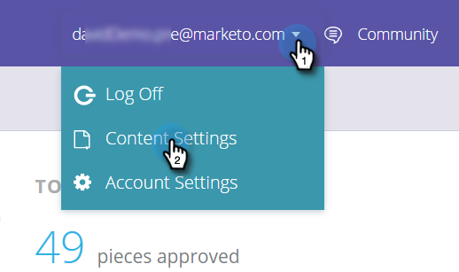

# コンテンツ検出を有効にする {#enable-content-discovery}

コンテンツ発見機能は、既に存在するコンテンツ（ケーススタディ、ブログ投稿、動画、プレスリリースなど）を自動的に発見し、タグ付けします。 ビュー数を追跡することもできます。  予測コンテンツは、検出されたコンテンツに対して予測分析を行い、上位のコンテンツを特定して、最適なコンテンツを適切な人物に推奨します。

1. 「**[!UICONTROL コンテンツ設定]**」に移動します。

   

1. [!UICONTROL コンテンツ検出]を&#x200B;**[!UICONTROL オン]**&#x200B;にします。

   

[!UICONTROL コンテンツ検出]を[!UICONTROL オン]に設定すると、web 訪問者がファイルをクリックしたりビデオを視聴したりしたときに、PDF またはビデオコンテンツが自動的に検出されます。 このコンテンツ（URL、コンテンツ名、画像 URL）は追加され、すべてのコンテンツページでトラッキングされます。 ビデオの自動検出では、web 訪問者が YouTube、[!DNL Vimeo] または [!DNL Wistia] から埋め込みビデオをクリックし、視聴したときにビデオを検出します。 他のコンテンツを自動検出するには、[コンテンツパターンを作成](/help/marketo/product-docs/predictive-content/getting-started/create-content-patterns.md)する必要があります。
