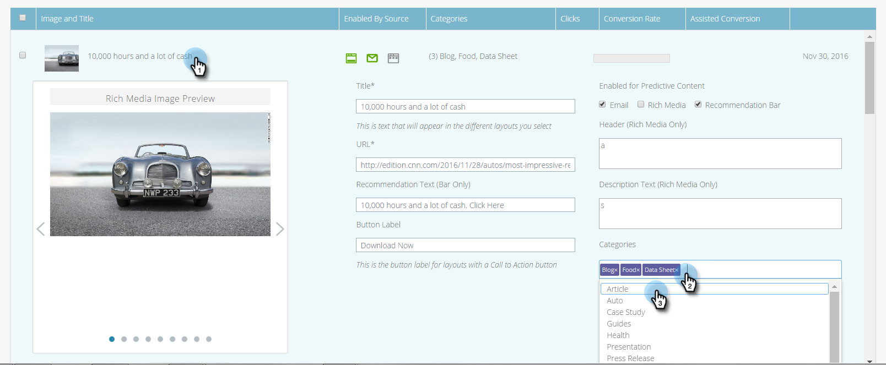
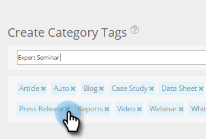

# カテゴリの設定 {#set-up-categories}

予測コンテンツでカテゴリを作成し、Web または E メールで予測結果をグループ化します。 例えば、ブログのみ、または特定の言語のコンテンツで作業できます。 また、ページビューを検索およびフィルターできます。  カテゴリは、簡単に参照できるように、すべてのコンテンツページと予測コンテンツページに表示されます。

検出されたコンテンツを編集する場合は、編集画面でカテゴリを追加します。 「 **カテゴリ** 」フィールドを開き、ドロップダウンから選択します。

コンテンツを追加する際に、ポップアップで選択したカテゴリでタグ付けできます。

## カテゴリタグの作成 {#create-category-tags}

次に、カテゴリタグの作成方法を示します。

1. 「**コンテンツ設定**」に移動します。

   

1. クリック **カテゴリ**.

   

1. 既存のカテゴリタグが表示されます。 新しいカテゴリタグを入力し、 **新規作成**.

   

1. カテゴリタグを削除するには、 **x** 隣に

   

1. クリック **保存** 終わったら

   

   簡単です
