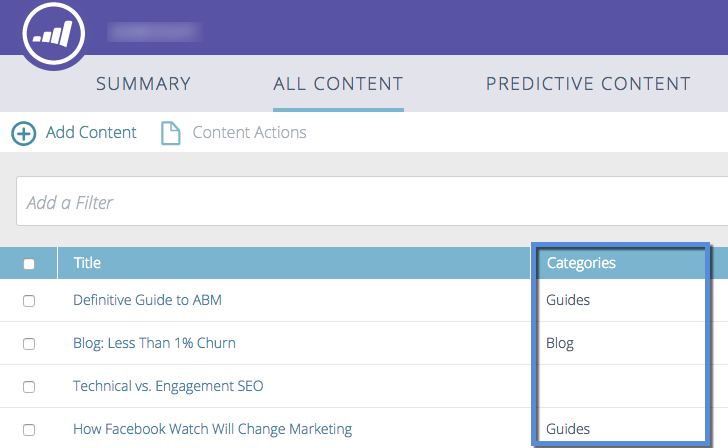
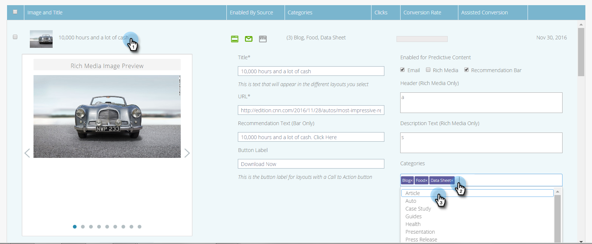
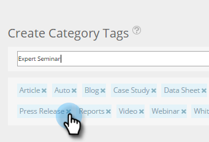

# カテゴリの設定 {#set-up-categories}

予測コンテンツでカテゴリを作成し、Web またはメールで予測結果をグループ化します。 例えば、ブログのみ、または特定の言語のコンテンツで作業できます。 また、ページビューを検索およびフィルタリングすることもできます。  カテゴリは、簡単に参照できるように、[!UICONTROL すべてのコンテンツ]ページと[!UICONTROL 予測コンテンツ]ページに表示されます。

検出されたコンテンツを編集する際は、編集画面でカテゴリを追加します。 「**[!UICONTROL カテゴリ]**」フィールドをクリックして、ドロップダウンから選択します。

コンテンツを追加する際に、ポップアップで選択したカテゴリでタグ付けできます。

## カテゴリタグの作成 {#create-category-tags}

次に、カテゴリタグの作成方法を示します。

1. 「**[!UICONTROL コンテンツ設定]**」に移動します。

   

1. 「**[!UICONTROL カテゴリ]**」をクリックします。

   

1. 既存のカテゴリタグが表示されます。 新しいカテゴリタグを入力し「**[!UICONTROL 新規作成]**」をクリックします。

   

1. カテゴリタグを削除するには、横にある「**x**」をクリックします。

   

1. 完了したら、**[!UICONTROL 保存]**&#x200B;をクリックします。

   

   簡単です。
