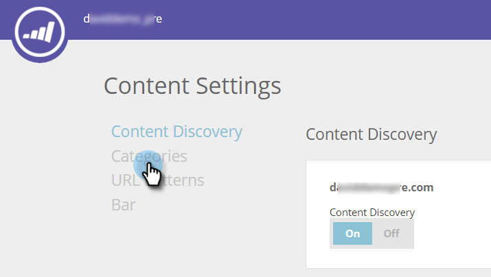
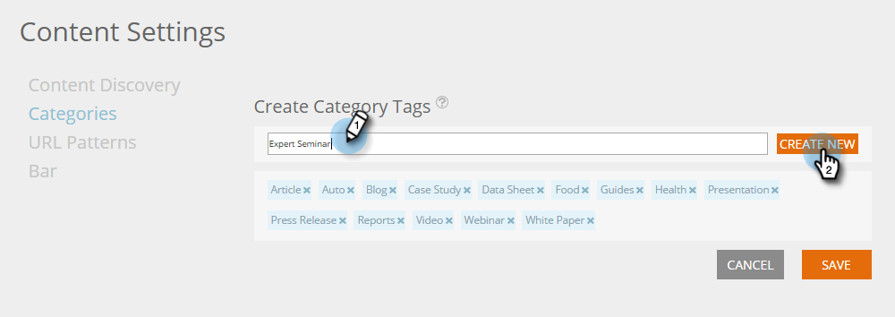

# カテゴリの設定{#set-up-categories}

>[!NOTE]
>
>購入日に応じて、マーケティング担当者の購読に、マーケティング担当者の予測コンテンツまたはコンテンツ`AI`が含まれる場合があります。 予測コンテンツを使用するユーザーの場合、Marketing Cloudでは、2018年4月30日までコンテンツ`AI`分析機能を有効にしています。 これらの機能をこの日以降に引き続き使用するには、マーケティング担当カスタマーサクセスマネージャーにお問い合わせの上、マーケティングコンテンツ`AI`にアップグレードしてください。

予測コンテンツのカテゴリを作成して、Webや電子メールで予測結果をグループ化します。 例えば、ブログ、または特定の言語のコンテンツに対してのみ作業を行うことができます。 また、ページ表示を検索およびフィルターすることもできます。  カテゴリは、すべてのコンテンツページと予測コンテンツページに表示され、参照しやすくなっています。

検出されたコンテンツを編集する場合は、編集画面でカテゴリを追加します。 **カテゴリ**&#x200B;フィールドをクリックし、ドロップダウンから選択します。

コンテンツを追加する際に、ポップアップで選択したカテゴリを使用してタグを付けることができます。

## カテゴリタグの作成{#create-category-tags}

カテゴリタグの作成方法を次に示します。

1. 「**コンテンツ設定**」に移動します。

   

1. **カテゴリ**&#x200B;をクリックします。

   

1. 既存のカテゴリタグが表示されます。 新しいカテゴリタグを入力し、**新規作成**&#x200B;をクリックします。

   

1. カテゴリタグの横にある&#x200B;**x**&#x200B;をクリックすると、そのユーザータグを削除できます。

   

1. 終了したら「**保存**」をクリックします。

   

   とても単純です

