# 予測コンテンツ分析の概要 {#predictive-content-analytics-overview}

コンテンツ分析を使用して、既存のコンテンツに関するさらなるインサイトを得、（AI および予測アルゴリズムに基づく）どのコンテンツがオーディエンスに役立つかを学び、マーケティング活動からの ROI を向上させます。

>[!NOTE]
>
>「[!UICONTROL 分析]」タブおよびコンテンツ分析機能は、Marketo 予測コンテンツでのみ使用できます。

## 概要 {#overview}

概要ページで、「**[!UICONTROL 分析]**」をクリックします。

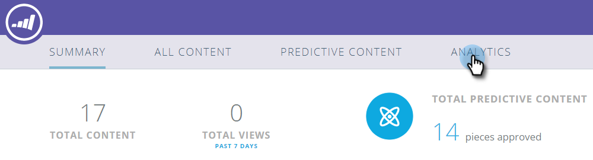

[!UICONTROL 分析]は、複数のセクション（[!UICONTROL 最も閲覧数の多いコンテンツ]、[!UICONTROL コンバージョン率の最も高いコンテンツ]、[!UICONTROL トレンド分析コンテンツ]、[!UICONTROL 推奨コンテンツ]、[!UICONTROL コンテンツ]）で構成されます。

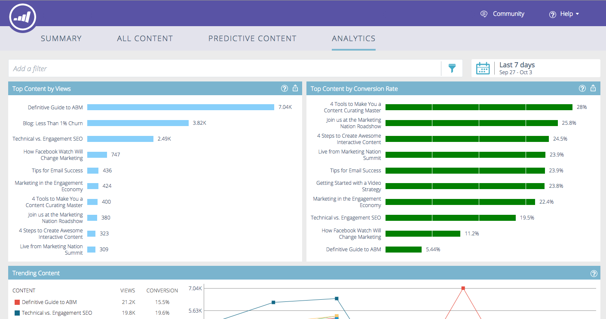

追加の詳細については、任意のセクションヘッダーの疑問符にマウスポインタを合わせます。

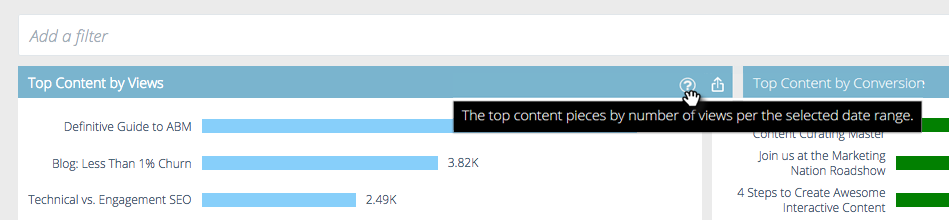

「書き出し」ボタンをクリックして、そのセクションの結果を Excel で書き出します。

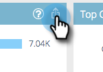

様々な属性／プロパティ（[!UICONTROL ABM アカウントリスト]、[!UICONTROL 国]など）で結果をフィルタリングできます。

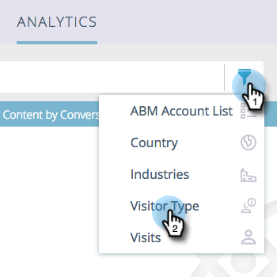

カレンダーアイコンをクリックして、反映されたデータの日付を変更します。 事前に設定した時間または特定の日付範囲を選択します。

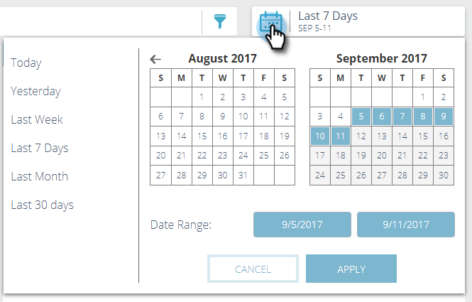

## [!UICONTROL 最も閲覧数の多いコンテンツ] {#top-content-by-views}

選択した日付範囲あたりの閲覧回数が最も多いコンテンツを表示します。

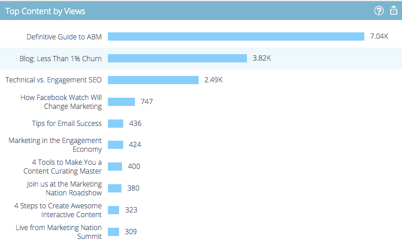

## [!UICONTROL コンバージョン率の最も高いコンテンツ] {#top-content-by-conversion-rate}

選択した日付範囲のコンバージョン率を基準に、コンバージョン率の最も高いコンテンツを表示します。

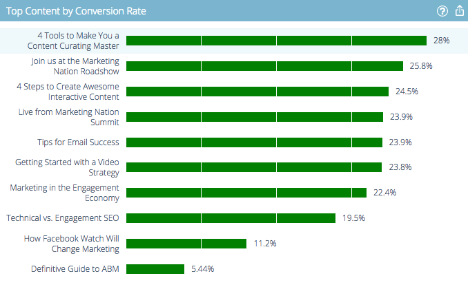

>[!NOTE]
>
>**定義**
>
>**コンバージョン率**：ダイレクトコンバージョンをクリック数で割って計算した割合.

## [!UICONTROL トレンド分析コンテンツ] {#trending-content}

過去 2 週間とその前の 2 週間の閲覧回数を比較し、コンテンツの人気上昇を表示します。

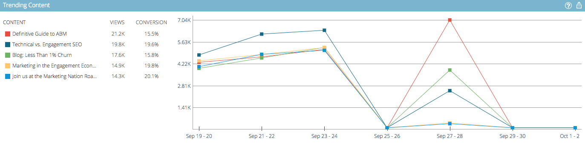

## [!UICONTROL 推奨コンテンツ] {#suggested-content}

お客様が定義したフィルターに基づき、マーケティング活動での促進を提案するコンテンツを表示します。

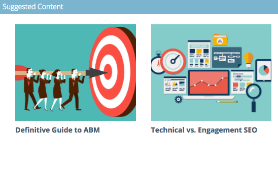

「推奨コンテンツ」の画像にマウスポインタを合わせると、使用可能なオプションが表示されます。

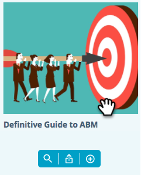

>[!NOTE]
>
>下のアイコンが見えますか？ 左から右に、[!UICONTROL コンテンツを表示]、[!UICONTROL CSV への書き出し]、[!UICONTROL コンテンツを承認]が表示されます。

## [!UICONTROL コンテンツ] {#content}

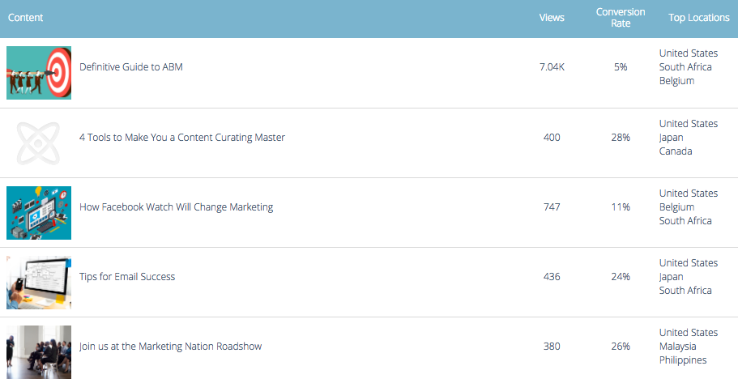

目的のコンテンツを検索し、それをクリックして、新規訪問者と再訪問者、既知の訪問と匿名訪問者、コンテンツ閲覧時の訪問者の訪問元である上位の場所、および訪問者の推測される上位の業界のような追加の詳細を表示します。

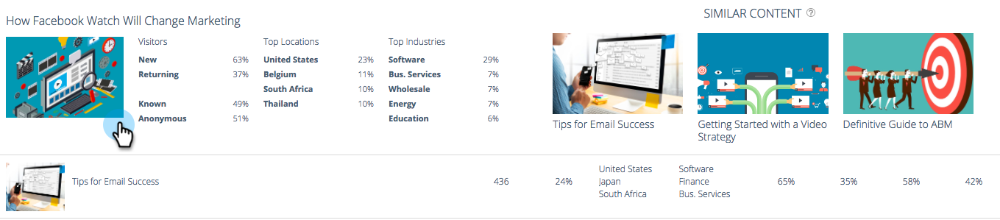

>[!NOTE]
>
>同様のコンテンツは選択したコンテンツに基づき、アソシエーションルールアルゴリズムで計算されます。 結果では、選択した部分と過去の訪問者の行動に応じて、訪問者が最もクリックする可能性が高いコンテンツを表します。 フィルターや日付範囲は考慮しません。
