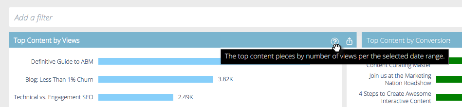

# 予測コンテンツ分析の概要{#predictive-content-analytics-overview}

コンテンツ分析を使用して既存のコンテンツに対するさらなるインサイトを得、オーディエンスにとってどのコンテンツが効果を発揮するか（AIと予測アルゴリズムに基づく）を知り、マーケティング活動からROIを増やします。

>[!NOTE]
>
>「解析」タブおよびコンテンツ分析機能は、マーケティング担当者向け予測コンテンツでのみ利用できます。

## 概要{#overview}

概要ページで、「解析」をクリックします。

Analyticsは、次のいくつかのセクションで構成されます。表示別の上位のコンテンツ、コンバージョン率別の上位のコンテンツ、傾向分析のコンテンツ、推奨コンテンツおよびコンテンツ。

追加の詳細を表示するには、セクションヘッダーの疑問符の上にマウスポインターを置きます。

「エクスポート」ボタンをクリックして、Excelを使用してセクションの結果をエクスポートします。

様々な属性/プロパティ(ABMアカウントリスト、国など)で結果をフィルタリングできます。

カレンダーアイコンをクリックして、反映されたデータの日付を変更します。 事前設定した時間、または特定の日付範囲を選択します。

## 表示別の上位のコンテンツ{#top-content-by-views}

選択した日付範囲における表示数別に、上位のコンテンツの要素を表示します。

## コンバージョン率別上位のコンテンツ{#top-content-by-conversion-rate}

選択した日付範囲で、コンバージョン率別にコンバージョン率が最も高いコンテンツを表示します。

>[!NOTE]
>
>**定義**
>
>**コンバージョン率**:直接コンバージョン数をクリック数で割って計算した割合。

## コンテンツのトレンド{#trending-content}

過去2週間の表示の増加を前期と比較して、コンテンツ曲の人気の高まりを表示します。

## 推奨コンテンツ{#suggested-content}

定義したフィルターに基づいて、マーケティングアクティビティでプロモーションすることを推奨するコンテンツを表示します。

「推奨コンテンツ」内の画像の上にカーソルを置くと、使用可能なオプションが表示されます。

>[!NOTE]
>
>**説明**
>
>下部にアイコンが表示されますか？ 左から右は次のとおりです。表示コンテンツ、CSVへのエクスポート、コンテンツの承認を参照してください。

## コンテンツ{#content}

目的のコンテンツを検索してクリックすると、次のような追加の詳細情報が表示されます。訪問者がコンテンツを見ている場合、新規訪問者と再訪問者、既知の訪問者、匿名訪問者、訪問者がコンテンツを見ている場所の上位、および訪問者の出身業種の上位が推測されます。

>[!NOTE]
>
>類似のコンテンツは、選択されたコンテンツピースに基づき、関連付けルールアルゴリズムによって計算される。 結果は、選択したピースと過去の訪問者の動作に応じて、訪問者がクリックする可能性が最も高いコンテンツの部分を表します。 フィルターや日付範囲は考慮されません。

