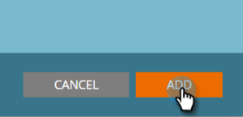

# 追加新しいコンテンツ{#add-new-content}

>[!NOTE]
>
>購入日に応じて、マーケティング担当者の購読に、マーケティング担当者の予測コンテンツまたはコンテンツ`AI`が含まれる場合があります。 予測コンテンツを使用するユーザーの場合、Marketing Cloudでは、2018年4月30日までコンテンツ`AI`分析機能を有効にしています。 これらの機能をこの日以降に引き続き使用するには、マーケティング担当カスタマーサクセスマネージャーにお問い合わせの上、マーケティングコンテンツ`AI`にアップグレードしてください。

コンテンツは、すべてのコンテンツページに手動で簡単に追加できます。

1. 「**追加コンテンツ**」ドロップダウンをクリックし、「**追加コンテンツ**」を選択します。

   

1. タイトルとURL、および必要に応じて画像URLを入力します。

   

1. カテゴリを追加するには、フィールドをクリックし、ドロップダウンから選択します。

   

1. **追加**&#x200B;をクリックします。

   

1. 新しいタイトルが&#x200B;**すべてのコンテンツ**&#x200B;ページに表示されます。 予測コンテンツは、まだ承認されていません。

   

1. [予測コンテンツ](http://docs.marketo.com/x/Vbet)に追加する方法を次に示します。

