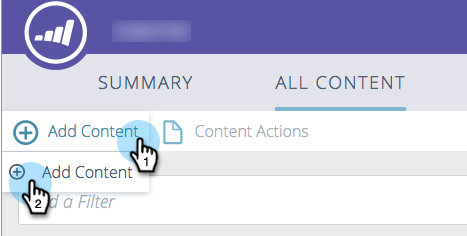
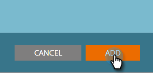

# 新規コンテンツの追加 {#add-new-content}

[!UICONTROL すべてのコンテンツ]ページには、コンテンツを手動で簡単に追加できます。

1. **[!UICONTROL コンテンツを追加]**&#x200B;ドロップダウンをクリックして、「**[!UICONTROL コンテンツを追加]**」を選択します。

   

1. タイトルと URL を入力し、必要に応じて画像 URL を入力します。

   

1. カテゴリを追加するには、フィールドをクリックして、ドロップダウンから選択します。

   

1. 「**[!UICONTROL 追加]**」をクリックします。

   

1. 新しいタイトルが&#x200B;**[!UICONTROL すべてのコンテンツ]**&#x200B;ページに表示されます。予測コンテンツにはまだ承認されていません。

   

1. [予測コンテンツ](/help/marketo/product-docs/predictive-content/working-with-all-content/approve-a-title-for-predictive-content.md)に追加する方法は、次のとおりです。
