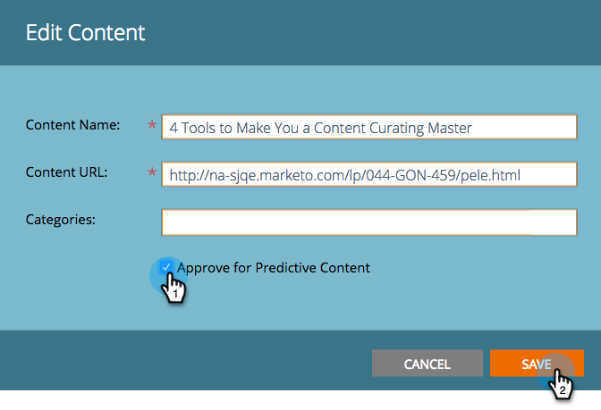

# 予測コンテンツのタイトルの承認 {#approve-a-title-for-predictive-content}

>[!NOTE]
>
>購入日に応じて、マーケティング担当購読に「予測コンテンツ」または「コンテンツ`AI`」が含まれる場合があります。 予測コンテンツを使用するユーザーの場合、Marketing Cloudでは、2018年4月31日までコンテンツ`AI` 分析機能を有効にしています。 これらの機能をこの日以降に引き続きご利用いただくには、マーケティング担当者カスタマーサクセスマネージャーにお問い合わせの上、マーケティングコンテンツにアップグレードしてください`AI`。

すべてのコンテンツページまたはコンテンツを編集ポップアップで承認することで、予測コンテンツに対してすべてのコンテンツページの任意のタイトルを追加できます。

## すべてのコンテンツページ {#all-content-page}

1. コンテンツの横のチェックボックスをオンにします。

   

1. 「 **コンテンツアクション** 」ドロップダウンをクリックし、「予測コンテンツに対して **承認**」を選択します。

   

## コンテンツを編集ポップアップ {#edit-content-pop-up}

コンテンツを編集ポップアップで、予測用のコンテンツのタイトルを直接承認することもできます。

1. コンテンツの一部の上にカーソルを置き、行の最後にある編集アイコンをクリックします。

   

1. 「コンテンツを編集」ポップアップの「 **予測コンテンツを** 承認 **」ボックスをオンにし、「**&#x200B;保存」をクリックします。

   

どちらの方法を使用しても、「予測コンテンツを承認」アイコンが行に表示されます。

予測コンテンツページにタイトルが表示されるようになりました。

