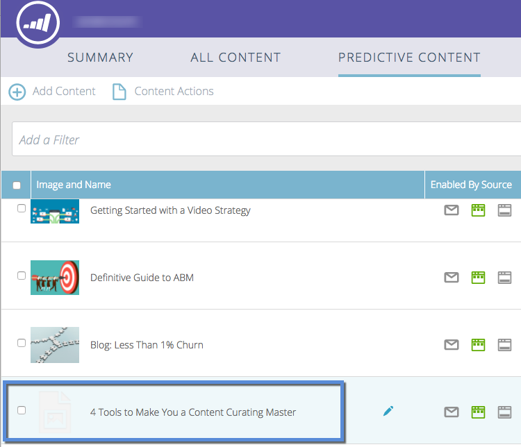

# 予測コンテンツのタイトルの承認 {#approve-a-title-for-predictive-content}

[!UICONTROL &#x200B; すべてのコンテンツ &#x200B;] ページまたは [!UICONTROL &#x200B; コンテンツを編集 &#x200B;] ポップアップで承認することで、[!UICONTROL &#x200B; すべてのコンテンツ &#x200B;] ページに任意のタイトルを予測コンテンツに追加できます。

## [!UICONTROL &#x200B; すべてのコンテンツ &#x200B;] ページ {#all-content-page}

1. コンテンツの横にあるボックスをオンにします。

   

1. 「**[!UICONTROL コンテンツアクション]**」ドロップダウンをクリックし、「**[!UICONTROL 予測コンテンツの承認]**」を選択します。

   

## [!UICONTROL &#x200B; コンテンツを編集 &#x200B;] ポップアップ {#edit-content-pop-up}

また、[!UICONTROL &#x200B; コンテンツを編集 &#x200B;] ポップアップで、予測コンテンツのタイトルを直接承認することもできます。

1. コンテンツの一部にカーソルを移動し、行の最後にある編集アイコンをクリックします。

   

1. **[!UICONTROL コンテンツを編集]** ポップアップの「[!UICONTROL &#x200B; 予測コンテンツの承認 &#x200B;] ボックスをオンにして、「**[!UICONTROL 保存]**」をクリックします。

   

どちらの方法を使用する場合でも、「[!UICONTROL &#x200B; 予測コンテンツの承認 &#x200B;] アイコンが行に表示されます。

これで、「予測コンテンツ [!UICONTROL &#x200B; ページに表示されたタイトルを確認でき &#x200B;] す。

