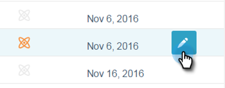
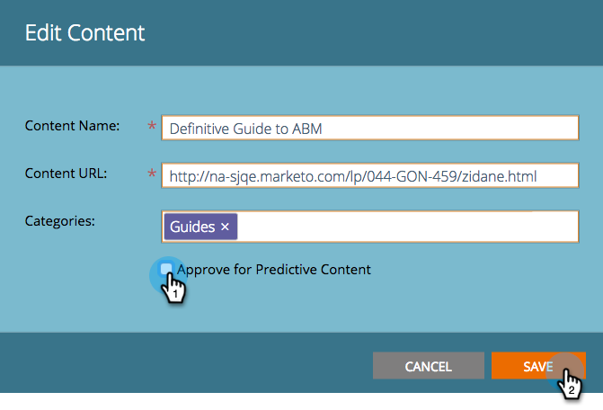

# [!UICONTROL 予測コンテンツ]のタイトルの承認取消 {#unapprove-a-title-for-predictive-content}

予測コンテンツのタイトルは、[!UICONTROL すべてのコンテンツ]ページまたは[!UICONTROL コンテンツを編集]ポップアップで承認を取り消すことができます。

## [!UICONTROL すべてのコンテンツ]ページ {#all-content-page}

1. [!UICONTROL すべてのコンテンツ]ページで、コンテンツの横にあるチェックボックスをオンにして選択します。

   

1. **[!UICONTROL コンテンツアクション]**&#x200B;ドロップダウンをクリックし、「**[!UICONTROL 予測コンテンツの承認取消]**」を選択します。

   

## [!UICONTROL コンテンツを編集]ポップアップ {#edit-content-pop-up}

タイトルを編集中に未承認にすることができます。

1. 承認を取り消すコンテンツのタイトルが含まれる行にカーソルを置き、編集アイコンをクリックします。

   

1. 「**[!UICONTROL 予測コンテンツの承認]**」ボックスをオフにし、「**[!UICONTROL 保存]**」をクリックします。

   

どの方法を使用しても、[!UICONTROL すべてのコンテンツ]ページに承認アイコンが表示されなくなり、[!UICONTROL 予測コンテンツ]ページにタイトルが表示されなくなります。

