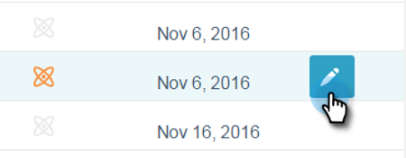

# 予測コンテンツのタイトルの承認取消 {#unapprove-a-title-for-predictive-content}

予測コンテンツのタイトルは、すべてのコンテンツページまたはコンテンツを編集ポップアップで承認を取り消すことができます。

## すべてのコンテンツページ {#all-content-page}

1. すべてのコンテンツページで、コンテンツの横にあるチェックボックスをオンにして選択します。

   

1. 「**コンテンツアクション**」ドロップダウンをクリックし、「**予測コンテンツの承認取消**」を選択します。

   

## コンテンツを編集ポップアップ {#edit-content-pop-up}

編集中にタイトルの承認を取り消すことができます。

1. 承認を取り消すコンテンツのタイトルが含まれる行にカーソルを置き、編集アイコンをクリックします。

   

1. 「**予測コンテンツの承認**」ボックスをオフにし、「**保存**」をクリックします。

   

どの方法を使用しても、すべてのコンテンツページに承認アイコンが表示されなくなり、予測コンテンツページにタイトルが表示されなくなります。

