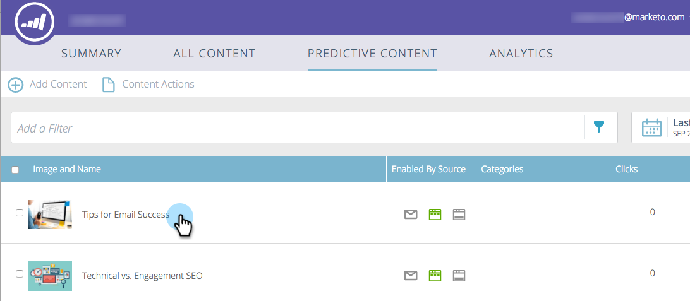
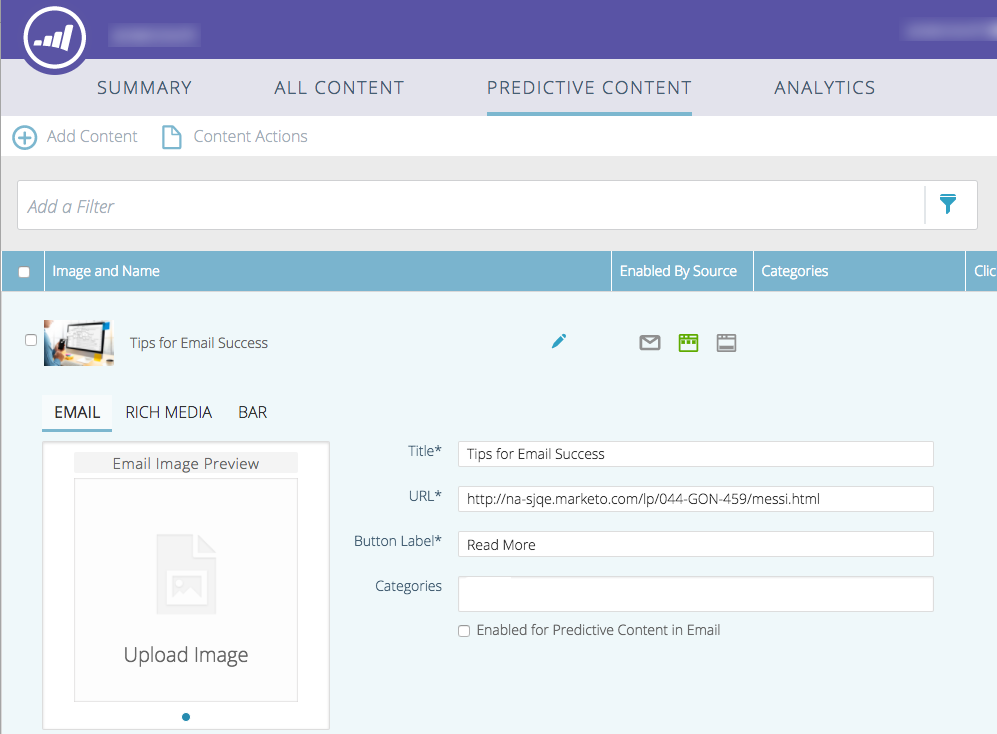
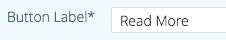
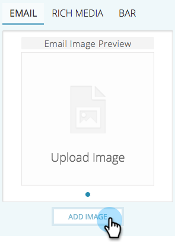
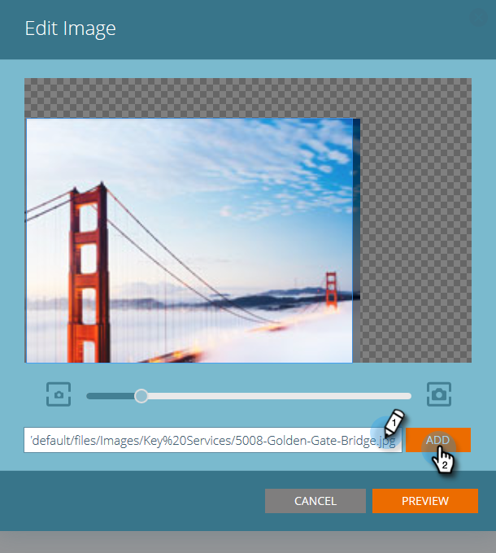
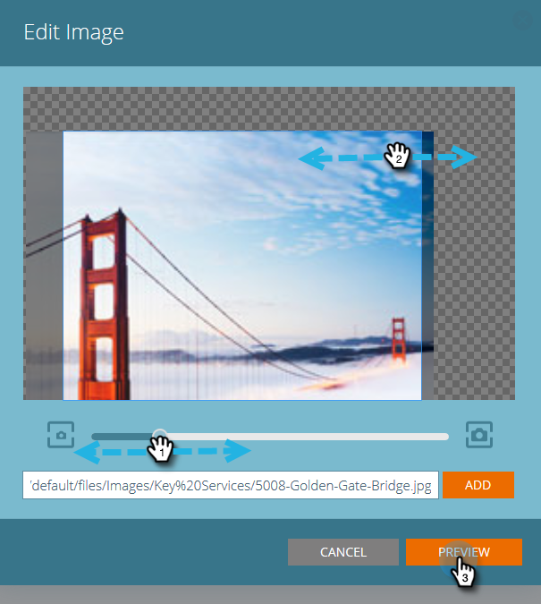
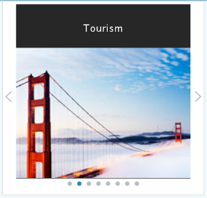
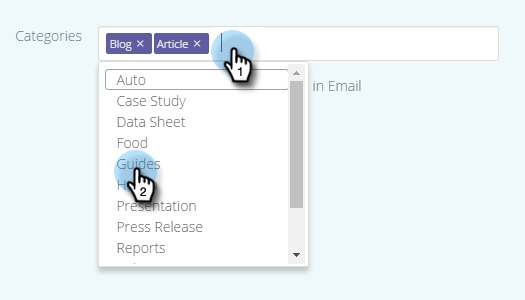
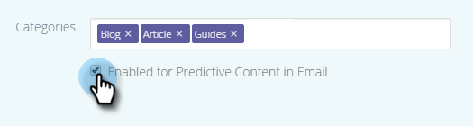

# メールの予測コンテンツの編集 {#edit-predictive-content-for-emails}

メールの予測コンテンツの設定方法を次に示します。

>[!PREREQUISITES]
>
>[!UICONTROL すべてのコンテンツ]ページで、コンテンツが[予測コンテンツに対して承認されている](/help/marketo/product-docs/predictive-content/working-with-all-content/approve-a-title-for-predictive-content.md)必要があります。

1. [!UICONTROL 予測コンテンツ]ページで、「タイトル」をクリックして、エディターを開きます。

   

1. 編集ページが開きます。 デフォルトでは&#x200B;**[!UICONTROL 電子メール]**&#x200B;が表示されます。

   

   >[!NOTE]
   >
   >タイトルと URL は既に入力されています。 正しいかどうかを確認してください。

1. ボタンのラベルを追加または編集するには、右側のテキストボックスに入力します。

   

   >[!NOTE]
   >
   >ボタンラベルを変更した場合、変更を保存するとき、または画像をプレビューするときに更新されます。

1. 画像 URL を追加または編集するには、「**[!UICONTROL 画像を編集]**」をクリックします。

   

   >[!CAUTION]
   >
   >最高の画質を確保するには、画像のサイズを 400 x 400 ピクセル以下にする必要があります。

1. 画像の URL を挿入し、「**[!UICONTROL 追加]**」をクリックします。

   

1. スライダーをクリックしてドラッグし、画像サイズを変更します。 次に、切り抜きボックスをクリックしてドラッグし、使用する画像領域を分離します。 終了したら、「**[!UICONTROL プレビュー]**」をクリックします。

   

1. 各メールレイアウトプレビューで、横にある矢印をクリックして、コンテンツを表示します（2 つのオプションが表示されます）。

   |  |  |
   |---|---|

1. 必要に応じて、「**[!UICONTROL カテゴリ]**」フィールドをクリックし、コンテンツにカテゴリを追加します。 オプションは、[既に設定済みのカテゴリ](/help/marketo/product-docs/predictive-content/getting-started/set-up-categories.md)です。

   

1. 「メールの予測コンテンツ」を有効にするには、チェックボックスをオンにします。

   

1. 「**[!UICONTROL 保存]**」をクリックします。

   

   >[!NOTE]
   >
   >Marketo メールエディターv2.0では、コンテンツを有効にする際に使用するレイアウトテンプレート ](/help/marketo/product-docs/predictive-content/enabling-predictive-content/enable-predictive-content-in-emails.md)を[表示することもできます。
