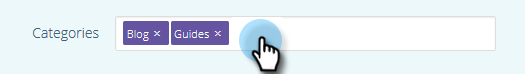

# リッチメディアの予測コンテンツの編集 {#edit-predictive-content-for-rich-media}

>[!NOTE]
>
>購入日に応じて、マーケティング担当購読に「予測コンテンツ」または「コンテンツAI」が含まれる場合があります。 予測コンテンツを使用するユーザーの場合、Marketing Cloudでは、2018年4月31日までContentAI Analyticsの機能を有効にしています。 これらの機能をこの日以降に引き続き使用するには、Marketor ContentAIにアップグレードする際に、担当のマーケティング担当者にお問い合わせください。

リッチメディア用の予測コンテンツを設定する方法を次に示します。

>[!PREREQUISITES]
>
>予測に使用できるコンテンツは、すべてのコンテンツページで [承認する必要があります](/help/marketo/product-docs/predictive-content/working-with-all-content/approve-a-title-for-predictive-content.md) 。

1. 「 **予測コンテンツ** 」ページで、タイトルをクリックしてエディターを開きます。

   

1. 「 **リッチメディア**」をクリックします。

   

1. 電子メール用とリッチメディア用に別々の画像を持つことができます。 画像を追加または変更するには、画像URLをテキストボックスに貼り付けます。

   

1. 「 **説明**」に入力します。

   

1. 設定済みの **カテゴリを選択または追加するには、** カテゴリ [・ボックスをクリックします](/help/marketo/product-docs/predictive-content/getting-started/set-up-categories.md) （オプション）。

   

   >[!NOTE]
   >
   >カテゴリを使用して、特定のリッチメディアレコメンデーションテンプレート用のコンテンツをグループ化します。 すべてのレコメンデーションテンプレートにコンテンツを適用する場合は、カテゴリを空のままにします（推奨）。
   >
   >ただし、リッチメディアテンプレートに特定のコンテンツのみをレコメンデーションする場合は、コンテンツのカテゴリを追加し、そのカテゴリをレコメンデーションテンプレートに関連付けます。
   >
   >例えば、Webサイトのセクション（製品やソリューション）に従って、関連するコンテンツを分類します。

1. リッチメディアで予測コンテンツを有効にする場合は、該当するチェックボックスをオンにします。

   

1. 「 **保存**」をクリックします。

   
