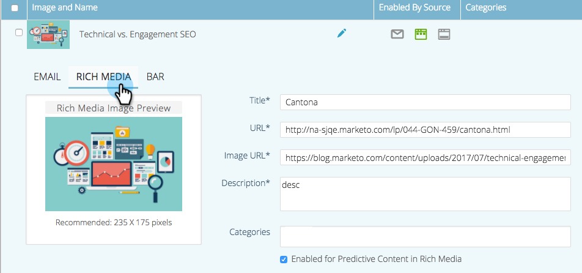

# リッチメディアの予測コンテンツを編集する {#edit-predictive-content-for-rich-media}

リッチメディア予測コンテンツの設定方法を次に示します。

>[!PREREQUISITES]
>
>コンテンツは、[ すべてのコンテンツ ](/help/marketo/product-docs/predictive-content/working-with-all-content/approve-a-title-for-predictive-content.md) ページの [!UICONTROL  予測コンテンツ向けの承認 ] が必要です。

1. **[!UICONTROL 予測コンテンツ]**&#x200B;ページで、「タイトル」をクリックして、エディターを開きます

   

1. 「**[!UICONTROL リッチメディア]**」をクリックします。

   

1. メールとリッチメディア用の画像は別々でも大丈夫です。画像を追加または変更するには、画像の URL をテキストボックスに貼り付けます。

   

   >[!NOTE]
   >
   >カラーモデル CMYK の JPEG 画像は、リッチメディアではサポートされません。JPEG は、カラープロファイルを使用して sRGB に変換する必要があります。画像エディターから書き出す際は、必ずこの設定を選択してください。

1. **説明**&#x200B;を入力します。

   

1. 「**[!UICONTROL カテゴリ]**」ボックスをクリックして、[既に設定済みのカテゴリ](/help/marketo/product-docs/predictive-content/getting-started/set-up-categories.md)を選択／追加します（オプション）。

   

   >[!NOTE]
   >
   >カテゴリを使用して、特定のリッチメディアレコメンデーションテンプレートのコンテンツをグループ化します。カテゴリを空のままにして、コンテンツをすべてのレコメンデーションテンプレートに適用します（推奨）。
   >
   >ただし、リッチメディアテンプレートに特定のコンテンツのみをレコメンデーションする場合は、コンテンツのカテゴリを追加し、そのカテゴリをレコメンデーションテンプレートに関連付けます。
   >
   >例えば、web サイトのセクション（製品やソリューション）に従ってコンテンツを分類します。

1. 「リッチメディアの予測コンテンツ」を有効にするには、チェックボックスをオンにします。

   

1. 「**[!UICONTROL 保存]**」をクリックします。

   
