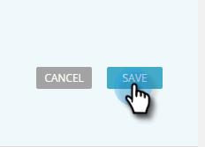

# レコメンデーションバーの予測コンテンツの編集 {#edit-predictive-content-for-the-recommendation-bar}

レコメンデーションバーに予測コンテンツを設定する方法は、以下のとおりです。

>[!PREREQUISITES]
>
>すべてのコンテンツページで、コンテンツが[予測コンテンツに対して承認されている](/help/marketo/product-docs/predictive-content/working-with-all-content/approve-a-title-for-predictive-content.md)必要があります。

1. **予測コンテンツ**&#x200B;ページで、「タイトル」をクリックして、エディターを開きます

   

1. 「**バー**」をクリックします。

   

1. レコメンデーションバーで予測コンテンツを有効にするには、チェックボックスをオンにします。

   

1. 「**保存**」をクリックします。

   
