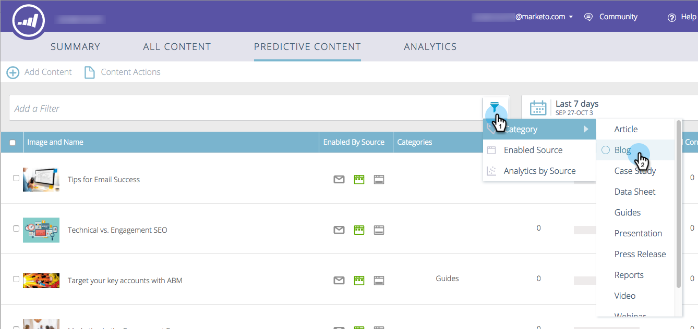

# 予測コンテンツについて{#understanding-predictive-content}

>[!NOTE]
>
>購入日に応じて、マーケティング担当者の購読に、マーケティング担当者の予測コンテンツまたはコンテンツ`AI`が含まれる場合があります。 予測コンテンツを使用するユーザーの場合、Marketing Cloudでは、2018年4月30日までコンテンツ`AI`分析機能を有効にしています。 これらの機能をこの日以降に引き続き使用するには、マーケティング担当カスタマーサクセスマネージャーにお問い合わせの上、マーケティングコンテンツ`AI`にアップグレードしてください。

[予測コンテンツのタイトルを承認](//help/marketo/product-docs/predictive-content/working-with-all-content/approve-a-title-for-predictive-content.md)した後は、ここで作業します。 予測コンテンツページには、予測コンテンツに対して承認したすべてのタイトルが表示されます。

ページのフィールドには次のものがあります。

* **画像とタイトル**:コンテンツの名前と選択した画像
* **Enabled by Source**:タイトルがリッチメディア、電子メール、またはレコメンデーションバーに対して承認されているかどうかを表示します。
* **カテゴリ**:自分が作成し、Webや電子メールに対する予測結果をグループ化するために使用します。
* **クリック数**:推奨コンテンツ（すべてのソースを含む）の合計クリック数
* **コンバージョン率**:直接コンバージョン数をクリック数で割って計算した割合。ホバーで追加のデータを表示（以下を参照）
* **アシストコンバージョン**:過去の訪問でレコメンデーションコンテンツをクリックし、後でフォームを完成した訪問者

## コンテンツのフィルタ{#filtering-content}

**カテゴリ**

作成したカテゴリでコンテンツをフィルタリングできます。 フィルターアイコンをクリックし、**カテゴリ**&#x200B;の下で、1つ以上のコンテンツカテゴリーを選択します。

**有効なソース**

有効なコンテンツのタイプ別にフィルター：電子メール、リッチメディア、レコメンデーションバーを参照してください。

**ソース別の分析**

フィルターを有効にしたコンテンツ分析を使用すると、各ソースのパフォーマンスを確認できます。

## 日付別に解析を表示{#display-analytics-by-date}

1. 右側の開始と終了日を選択します（図を参照）。 「**適用**」をクリックします。

   

## 予測コンテンツの表示表データ{#view-table-data-for-predictive-content}

表では、左から右へ、どのソースから予測コンテンツが有効になっているかを表示できます。レコメンデーションバー、電子メールおよびリッチメディアを参照してください。 有効なソースは緑色で表示されます。 これらを有効にするには、コンテンツ[を編集](http://docs.marketo.com/display/docs/edit+predictive+content)します。

「コンバージョン率」列のバーの上にカーソルを置くと、表示コンバージョン率、ダイレクトコンバージョン、クリックされたデータが表示されます。

>[!NOTE]
>
>**定義**
>
>**コンバージョン率**:直接コンバージョン数をクリック数で割って計算した割合
>
>**直接コンバージョン**:レコメンデーションコンテンツをクリックし、同じ訪問でフォームに記入した訪問者
>
>**クリック済み**:推奨コンテンツに対する合計クリック数（3つのソースすべてを含む）

>[!MORELIKETHIS]
>
>* [予測コンテンツ](http://docs.marketo.com/display/docs/predictive+content)
>* [予測コンテンツの編集](http://docs.marketo.com/display/docs/edit+predictive+content)

