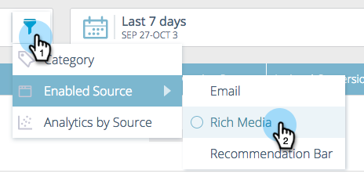

# 予測コンテンツについて {#understanding-predictive-content}

[予測コンテンツのタイトルを承認](/help/marketo/product-docs/predictive-content/working-with-all-content/approve-a-title-for-predictive-content.md)した後、ここで作業します。予測コンテンツページには、予測コンテンツに対して承認したすべてのタイトルが表示されます。

ページに表示されるフィールドは、次のとおりです。

* **画像とタイトル**：コンテンツの名前と選択した画像
* **ソースにより有効**：タイトルがリッチメディア、電子メールまたはレコメンデーションバーに対して承認されているかどうかを表示します。
* **カテゴリ**：ユーザーが作成し、web またはメールの予測結果をグループ化するために使用
* **クリック数**：推奨コンテンツの合計クリック数（すべてのソースを含む）
* **コンバージョン率**：ダイレクトコンバージョンをクリック数で割って計算した割合。カーソルを置くと追加のデータ（後述）が表示されます。
* **アシストコンバージョン数**：過去の訪問で、推奨されるコンテンツをクリックし、後でフォームに入力した web 訪問者数。

## コンテンツのフィルタリング {#filtering-content}

**カテゴリ**

作成したカテゴリを基準にコンテンツをフィルターできます。フィルターアイコンをクリックし、「**カテゴリ**」で、1 つ以上のコンテンツカテゴリを選択します。

**有効ソース**

メール、リッチメディア、レコメンデーションバーのうち、有効になっているコンテンツのタイプを基準にフィルターします。

**ソース別分析**

有効なコンテンツ分析をフィルターし、各ソースのパフォーマンスを確認できます。

## 日付別に分析を表示 {#display-analytics-by-date}

1. 右側で開始日と終了日を選択します（図を参照）。「**適用**」をクリックします。

   

## 予測コンテンツのテーブルデータの表示 {#view-table-data-for-predictive-content}

このテーブルでは、レコメンデーションバー、メール、リッチメディアのソースのうち、どれが予測コンテンツで有効か、左から右の順に示されます。有効なソースは緑色で表示されます。コンテンツを編集する際に、これらを有効にします。

「コンバージョン率」列のバーにカーソルを置くと、コンバージョン率、ダイレクトコンバージョン数、クリック数を確認できます。

>[!NOTE]
>
>**定義**
>
>**コンバージョン率**：ダイレクトコンバージョンをクリック数で割って計算した割合
>
>**ダイレクトコンバージョン**：推奨されるコンテンツをクリックし、同じ訪問中にフォームに入力した web 訪問者数。
>
>**クリック済み**：推奨されるコンテンツの合計クリック数（3 つのソースをすべて含む）。
