# 高度な BI 分析の概要 {#advanced-bi-analytics-overview}

高度なBI分析（旧Revenue ExplorerおよびAdvanced Report Builder）は、Marketo Engageデータに対する柔軟なレポートと視覚化インターフェイスを提供し、進捗状況やパフォーマンスなどの詳細を提供します。 より豊富なインタラクティブ機能とビジュアライゼーション、より高速なパフォーマンス、よりシームレスで直感的なユーザエクスペリエンスを備えています。

これらのアップグレードにより、時間の節約、より貴重なインサイトの獲得、最適化の促進、同僚や関係者との魅力的なデータストーリーの共有などが可能になります。

>[!PREREQUISITES]
>
>この機能にアクセスするには、高度な BI 分析アドオンを購入する必要があります。 詳しくは、アドビのアカウントチーム（担当のアカウントマネージャー）にお問い合わせください。

## 主な機能と利点 {#key-features-and-benefits}

* **高性能クエリエンジン**：大規模なデータセットのパフォーマンスを5倍に向上させ、より迅速なデータ処理、より高速なレポート読み込み、よりスムーズな分析エクスペリエンスを実現します。

* **リッチで魅力的なビジュアライゼーション**：グラフ、マップ、KPI指標などの組み込みのビジュアライゼーションオプションの大規模なコレクションにより、ダッシュボードをよりインサイトに満ちたインパクトのあるものにし、データ storytellingを大幅に強化します。

* **高度なインタラクティブ機能と動的フィルタリング**：動的スライサー、クロスフィルタリング、相互依存フィルターをビジュアル全体に適用します。 複数ページのレポートは、高度なドリルダウン、ドリルアップ、ドリルスルーをサポートし、データ検索を容易にします。

* **直感的なレポート作成インターフェイス**：ポイント&amp;クリック操作で、複数ページのドリルスルー報告書を含むレポート作成を簡単に行えます。 このインターフェイスにより、高度な専門知識を必要とせずに、複雑でインタラクティブなレポートを設計することができます。

* **PowerPoint書き出しを含む簡単な共有**：組み込みの共有機能により、インサイトを簡単に共有できます。 プレゼンテーション用のPowerPoint スライドを容易に生成できます。

## レポートの作成 {#create-a-report}

1. My Marketoで、**[!UICONTROL 高度なBI Analytics]** タイルをクリックします。

   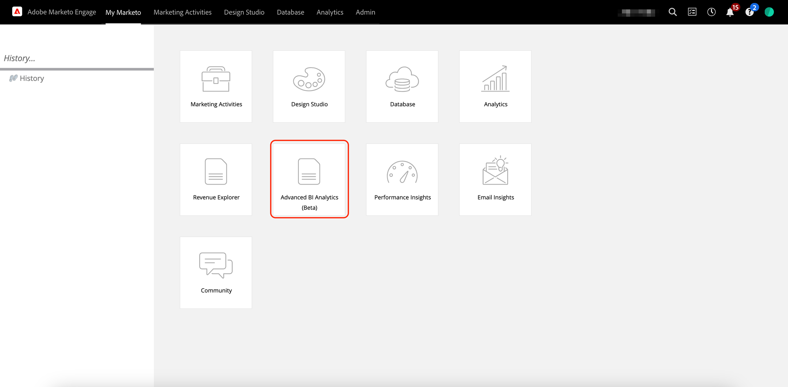{width="800" zoomable="yes"}

1. 「**[!UICONTROL レポート]**」タブで、「**[!UICONTROL レポートを作成]**」をクリックします。

   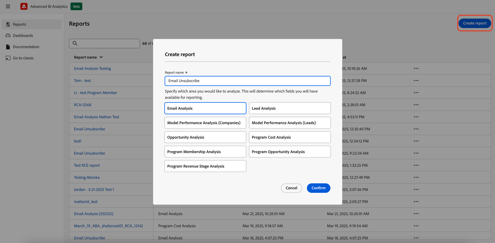{width="800" zoomable="yes"}

1. 目的の測定を選択します。

   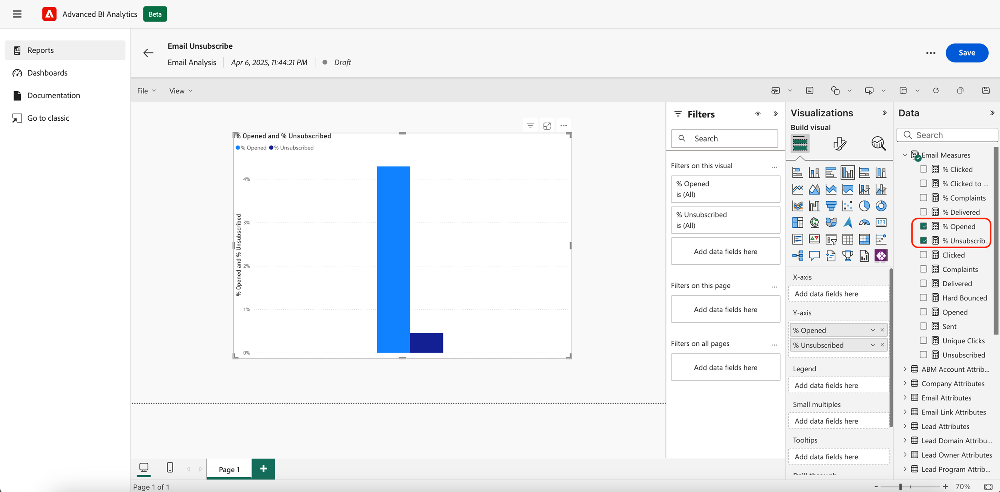{width="800" zoomable="yes"}

1. 必要な寸法を選択します。

   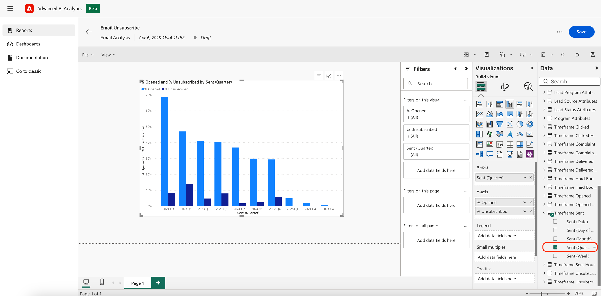{width="800" zoomable="yes"}

1. 好みのビジュアライゼーションを選択します。

   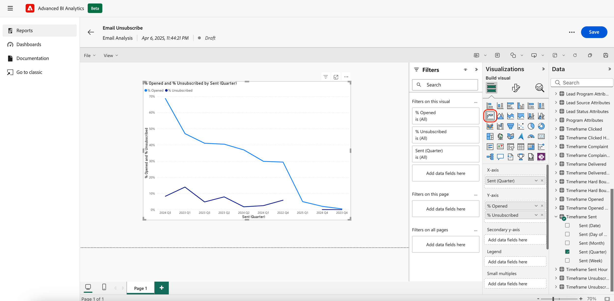{width="800" zoomable="yes"}

1. ディメンション属性をドラッグ&amp;ドロップしてフィルターを追加します。

   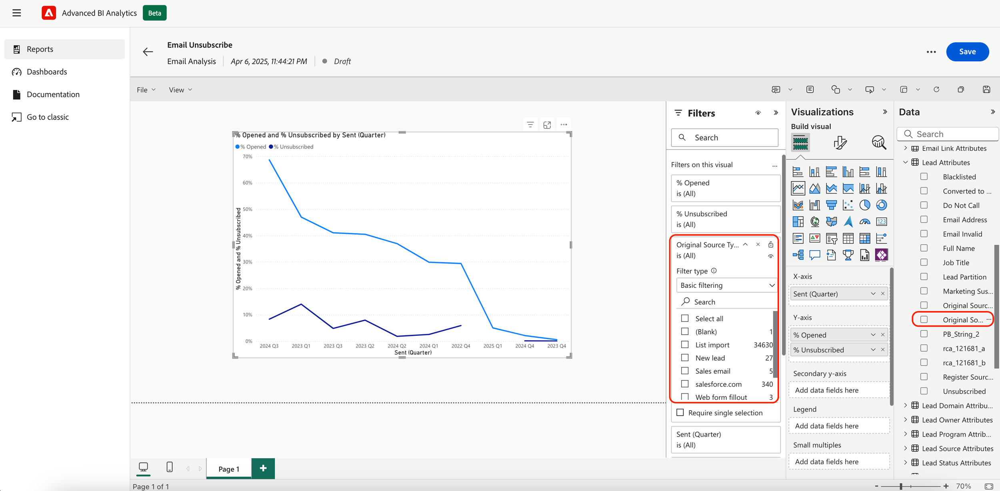{width="800" zoomable="yes"}

## レポートの書き出し {#export-a-report}

レポート全体を書き出す場合、書き出しオプションはPDFとPPTです。 .XLSまたは.CSVのデータが必要な場合は、個々のビジュアライゼーションを書き出します（[以下を参照](#export-a-visualization)）。

>[!BEGINTABS]

>[!TAB  レポートページから]

1. レポートページで、「その他」アイコン（。..）をクリックします。 **書き出し**&#x200B;を選択します。

   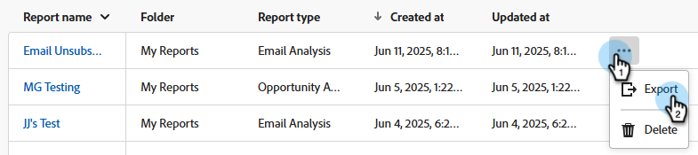

1. PDFまたはPPTを選択し、**書き出し**&#x200B;をクリックします。

   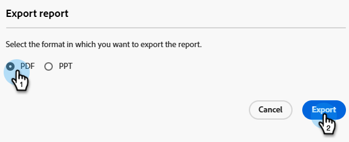

>[!TAB  レポート内]

1. レポート自体で、「詳細」アイコン（**...**）をクリックします。 右上の「**書き出し**」を選択します。

   

1. PDFまたはPPTを選択し、**書き出し**&#x200B;をクリックします。

   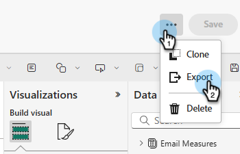

>[!ENDTABS]

### ビジュアライゼーションの書き出し {#export-a-visualization}

レポートの特定のセクションを書き出す方法について説明します。

1. 必要なレポートを選択します。

   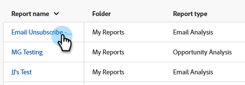{width="600" zoomable="yes"}

1. 表示されたビジュアライゼーションにカーソルを合わせると、3つのアイコンが表示されます。

   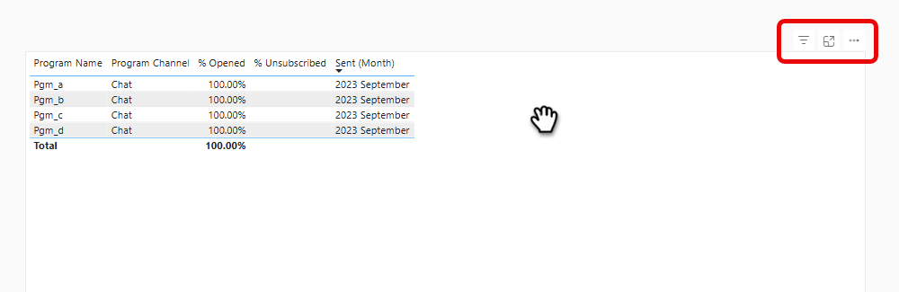{width="600" zoomable="yes"}

1. 「詳細」アイコン （**`...`**）をクリックします

   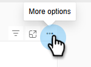

1. 「**データを書き出し**」を選択します。

   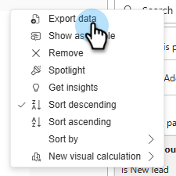

1. 必要なデータ形式を選択。

   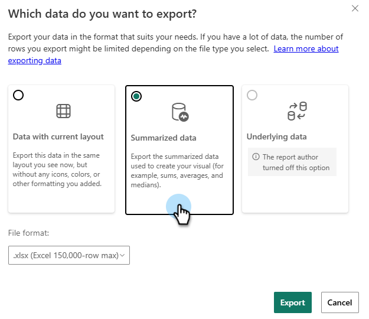

   >[!NOTE]
   >
   >* 現在のレイアウト _を持つ_ データは、テーブルと行列のビジュアルでのみ使用できます。
   >* _基礎となるデータ_&#x200B;はMarketo Engageでは利用できません。

1. 目的のファイル形式（.XLS、.CSV）を選択します。

   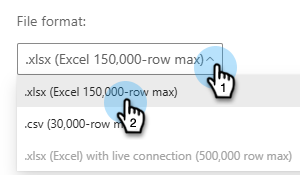

1. 「**エクスポート**」をクリックします。

## 動画デモ {#video}

マルチページのドリルスルーレポートエクスペリエンスの例については、次のビデオをご覧ください。

>[!VIDEO](https://video.tv.adobe.com/v/3451681/?quality=12&learn=on){transcript=true}

## 高度なBI分析の標準レポート {#standard-reports}

カスタムレポートの例として、次の標準レポートが含まれています。

<table>
  <thead>
    <tr>
      <th>レポート領域</th>
      <th>レポート名</th>
    </tr>
  </thead>
  <tbody>
    <tr>
      <td rowspan="8">メール分析</td>
      <td>電子メール – 送信されたアクティビティ（CST）</td>
    </tr>
    <tr>
      <td>電子メール – クリック アクティビティ（CST）</td>
    </tr>
    <tr>
      <td>電子メール – オープンアクティビティ（CST）</td>
    </tr>
    <tr>
      <td>電子メール – クリック時間配分（CST）</td>
    </tr>
    <tr>
      <td>電子メール – 開封率の減衰</td>
    </tr>
    <tr>
      <td>電子メール – 開封時間配分（CST）</td>
    </tr>
    <tr>
      <td>電子メール – パフォーマンスの詳細</td>
    </tr>
    <tr>
      <td>メール – クリック率の減衰</td>
    </tr>
    <tr>
      <td rowspan="8">リード分析</td>
      <td>コンバージョンしたリード別のリードソースのトップ 10</td>
    </tr>
    <tr>
      <td>リードソースの上位10件</td>
    </tr>
    <tr>
      <td>SLA侵害レポート</td>
    </tr>
    <tr>
      <td>リードエイジングレポート</td>
    </tr>
    <tr>
      <td>リード残高レポート</td>
    </tr>
    <tr>
      <td>リードコンバージョンレポート</td>
    </tr>
    <tr>
      <td>リードフローレポート</td>
    </tr>
    <tr>
      <td>リード移行時間レポート</td>
    </tr>
    <tr>
      <td rowspan="5">プログラム分析</td>
      <td>成功別の上位10 プログラム</td>
    </tr>
    <tr>
      <td>パイプライン別の上位10 プログラム</td>
    </tr>
    <tr>
      <td>プログラム収益ステージ・レポート</td>
    </tr>
    <tr>
      <td>上位10件の獲得プログラム</td>
    </tr>
    <tr>
      <td>マーケティングチャネル投資トレンド</td>
    </tr>
    <tr>
      <td rowspan="7">商談分析</td>
      <td>成約した機会へのマーケティング効果</td>
    </tr>
    <tr>
      <td>商談のクローズ成立に対するマーケティングの影響</td>
    </tr>
    <tr>
      <td>創出された商談に対するマーケティングの影響</td>
    </tr>
    <tr>
      <td>（FT） マーケティングが創出した機会への影響</td>
    </tr>
    <tr>
      <td>（MT）商談成立へのマーケティングの影響</td>
    </tr>
    <tr>
      <td>（MT） マーケティングが創出した機会への影響</td>
    </tr>
    <tr>
      <td>（FT）成約件数へのマーケティング効果</td>
    </tr>
    <tr>
      <td>商談リード分析</td>
      <td>商談獲得別のリードオーナーの上位10人</td>
    </tr>
  </tbody>
</table>

## 注意事項 {#note}

* カスタムレポートは、以下の「[新しいエクスペリエンスの学習](#learning-the-new-experience)」セクションで説明されている顕著な動作の変更を伴って、従来のエクスペリエンスから新しいエクスペリエンスにレプリケートされました。
* 従来のエクスペリエンスのダッシュボードは引き継ぎ可能ではなく、新しいエクスペリエンスで再作成が必要でした。 新しいエクスペリエンスでレポートとして再作成でき、新しいエクスペリエンスのフィルターは、可能な値を自動的に引き出します。

  >[!NOTE]
  >
  >新しいエクスペリエンスのダッシュボードは、単一ページのレポートの集まりにすぎません。 「新しいエクスペリエンスにおけるダッシュボードの主な価値は、さまざまなレポート領域をまたいで分析インサイトを提示できることです。

* Advanced BI Analyticsで&#x200B;**最大700件のレポート**&#x200B;を作成できます。

  >[!NOTE]
  >
  >Revenue Explorerに700を超えるレポートがある場合、一部のレポートは他のレポートと組み合わされ、レポート内のページを介して統合されます。
  >
  >* レポートにメールのサブスクリプションがある場合は、組み合わせませんでした。
  >* _同じフォルダー_&#x200B;内の残りのレポートは、レポート領域によって1つ以上のレポートに結合されました。 レポート領域に5つ以上のレポートがある場合、それらを1つ以上の結合レポートに統合しました。
  >* 組み合わせたレポートは5 ページ以下です。

* 特定のビジュアライゼーションでは、クエリごとに100万行の制限があります。 クエリがこれを超えると、次のエラーが表示されます：`The resultset of a query to external data source has exceeded the maximum allowed size of '1000000' rows`。 これを修正するには、日付範囲を減らすか、レポートのフィルターを調整して、クエリ結果の行数を減らします。

## 新しいエクスペリエンスを学ぶ {#learning-the-new-experience}

新しいビジュアライゼーションエクスペリエンスは、組み込みのPower BI サービスを介して提供されます。

ビジュアライゼーションエクスペリエンスに関する簡単なチュートリアルについては、Microsoftの[Power BIでのビジュアルの使用](https://learn.microsoft.com/en-us/training/modules/visuals-in-power-bi/){target="_blank"} ドキュメントを参照してください。 Marketo Engageにはこれらの機能がすべて表示されない場合があります。

### 顕著な顧客体験の変化 {#notable-experience-changes}

以下は、従来のエクスペリエンス（Revenue Explorer/Advanced Report Builder）からの新しいエクスペリエンス（Advanced BI Analytics）の変更点です。

* 日付型フィルターは同等に機能しますが、値を指定する構文が変更されました。 既存のカスタムレポートでは、「曜日」を除くすべての日付タイプのフィルター値が、新しいエクスペリエンスの対応する同等の値に自動的に変換されます。 「曜日」値のサポートは終了しました。

* 文字列タイプフィルターでは、大文字と小文字が区別されるようになりました。

* メール購読には、レポートのHTMLではなく、PDFの書き出しが含まれます。 新しいメール購読には、レポート定義が含まれていません。

* 現在、レポートのディープリンクはサポートされていません。

>[!NOTE]
>
>モデル パフォーマンス分析（リード）レポート領域のビジュアルに複数のカスタム フィールド グループ フィールドを含めることはできません。

>[!MORELIKETHIS]
>
>[指標とディメンション &#x200B;](/help/marketo/product-docs/reporting/advanced-bi-analytics/metrics-and-dimensions.md){target="_blank"}
